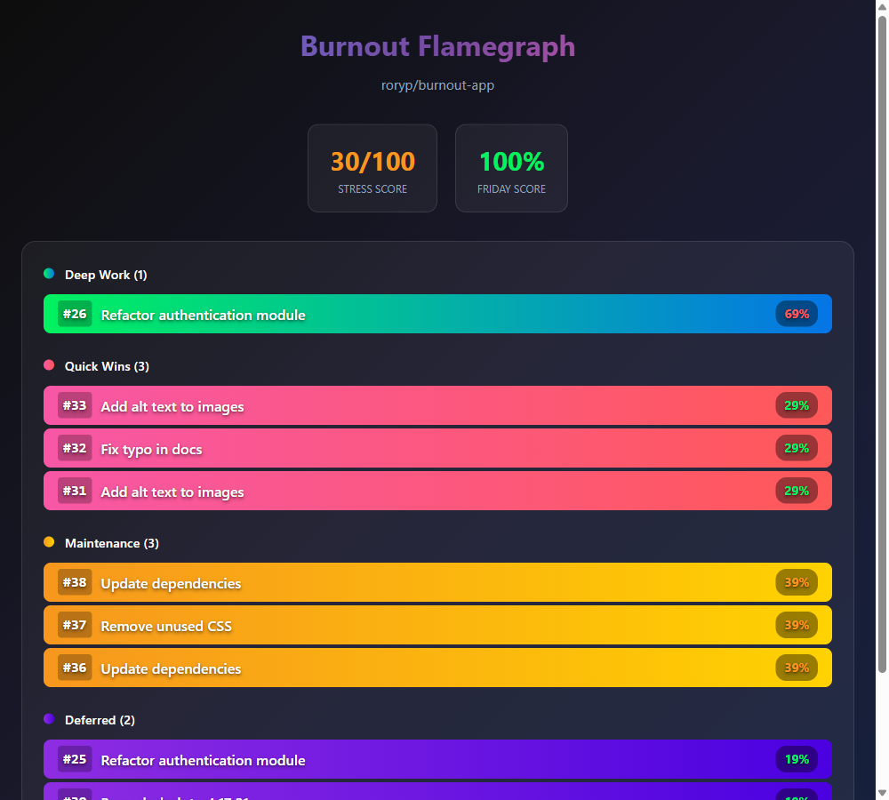

# Burnout-as-a-Service

An **MCP App** + Java backend that demonstrates **AI-powered burnout prevention** using LangChain4j's **Supervisor Pattern** (`langchain4j-agentic`), the **3-3-3 day structure**, and Azure OpenAI.



## What is This?

This project helps developers prevent burnout by intelligently managing their GitHub issue workload. The **Java backend** uses LangChain4j's `langchain4j-agentic` library with a **Supervisor Pattern** - a planner LLM orchestrates 5 specialized sub-agents (Defer, Delegate, Classify, Scope, Wellness) to analyze your assigned issues, detect stress signals, and automatically organize your day using the 3-3-3 structure: one deep work task, three quick wins, and three maintenance items. The **MCP App** exposes these capabilities as tools you can invoke directly from VS Code Copilot Chat, Claude Desktop, or any MCP-compliant client—simply ask it to show your burnout wheel, check your stress score, or reshape your day, and the AI does the rest.

## ✨ Features

- **🤖 LangChain4j Supervisor Pattern** - Uses `langchain4j-agentic` with 5 sub-agents orchestrated by Azure OpenAI (gpt-5-mini)
- **📊 3-3-3 Day Structure** - Automatically classifies issues into Deep Work, Quick Wins, and Maintenance
- **🛡️ Protective AI** - Detects stress signals and provides personalized wellness recommendations
- **📈 Chaos Scoring** - Measures workload chaos (context switching, mystery meat issues, after-hours work)
- **🎡 MCP App Visualization** - Interactive flamegraph with stress indicators and click-to-open GitHub issues

## Quick Start

### Prerequisites

- **GitHub CLI** (`gh`) installed and authenticated:
  ```bash
  gh auth login
  gh auth status  # Should show ✓ Logged in with 'repo' scope
  ```
- **VS Code Insiders** with GitHub Copilot (MCP Apps require Insiders)
- **Node.js 18+** (for MCP app)

Choose your deployment option:

---

## Option A: Deploy to Azure (Recommended)

One command deploys everything - Container Apps, Azure OpenAI, Container Registry with managed identity (no API keys needed).

### 1. Install Azure Developer CLI

```bash
# Windows
winget install Microsoft.Azd

# macOS
brew install azure/tap/azd

# Linux
curl -fsSL https://aka.ms/install-azd.sh | bash
```

### 2. Deploy to Azure

```bash
azd auth login
azd up
```

This provisions:
- Azure Container Apps (backend with 2 CPU, 4GB RAM)
- Azure OpenAI (gpt-5-mini with GlobalStandard deployment in Sweden Central)
- Azure Container Registry
- User-assigned managed identity for secure Azure OpenAI access

### 3. Build the MCP App

```bash
cd mcp-app
npm install
npm run build
```

### 4. Configure MCP to Use Azure Backend

Create a `.env` file in the project root with your backend URL (shown after `azd up`):

```env
BACKEND_URL=https://your-backend.wonderfulstone-xxxxx.swedencentral.azurecontainerapps.io
```

The `.vscode/mcp.json` is already configured to read from this file.

### 5. Restart MCP Server

In VS Code, open the MCP panel and restart the `burnout-app` server to pick up the new configuration.

---

## Option B: Local Development

### 1. Prerequisites (Local)

- Java 21+
- Maven
- Azure OpenAI endpoint (or modify for OpenAI API)

### 2. Configure Azure OpenAI

Create a `.env` file in the project root:

```env
AZURE_OPENAI_ENDPOINT=https://your-resource.openai.azure.com
AZURE_OPENAI_API_KEY=your-api-key
AZURE_OPENAI_DEPLOYMENT=gpt-5-mini
BACKEND_URL=http://localhost:8080
```

### 3. Start the Backend

```bash
cd backend
mvn clean package -DskipTests
java -jar target/burnout-backend-0.0.1-SNAPSHOT.jar
```

### 4. Build the MCP App

```bash
cd mcp-app
npm install
npm run build
```

### 5. Reload VS Code

The `.vscode/mcp.json` is already configured. Reload the window to activate the MCP server.

---

## Using the MCP Tools

In VS Code Copilot Chat, use these prompts to interact with the burnout prevention tools:

#### Step 1: Sync Your GitHub Issues (Required First)
```
Sync issues for owner/repo
```
This fetches your GitHub issues and syncs them to the backend for analysis.

#### Step 2: View Your 3-3-3 Day Structure
```
Show my burnout wheel for owner/repo
```
Displays an interactive flamegraph visualization showing:
- 🎯 **Deep Work** - Your one critical focused task
- ⚡ **Quick Wins** - Small completable items
- 🔧 **Maintenance** - Routine upkeep tasks
- 📦 **Deferred** - Items pushed to next sprint
- 📊 **Stress Score** and **Friday Score** metrics

**Hover** over any issue bar to see its stress percentage. **Click** to open the issue directly on GitHub.

#### Step 3: Get AI-Powered Insights
```
What's my stress score for owner/repo?
```
Quick check of your current stress level (🟢 Low / 🟡 Medium / 🔴 High).

```
Reshape my day for owner/repo
```
AI analyzes your workload and **automatically applies labels** to your GitHub issues (deep-work, quick-win, maintenance) to organize them into the 3-3-3 structure.

#### Alternative Prompt Styles
The tools understand natural language, so you can also try:
- `"Check burnout wheel for owner/repo"`
- `"Get stress score for owner/repo"`
- `"Analyze my workload for owner/repo"`
- `"What does my day look like for owner/repo?"`

> **Note**: Replace `owner/repo` with your actual GitHub repository (e.g., `myorg/my-project`)

## Architecture

```
┌─────────────────────────────────────────────────────────────────────┐
│  MCP App (Node.js + TypeScript)                                      │
│  - MCP server with stdio transport                                   │
│  - Tools: show_burnout_wheel, reshape_day, get_stress_score         │
│  - GitHub token auth via `gh auth token`                            │
│  - Works in VS Code, Claude Desktop, Cursor, etc.                   │
└──────────────────────┬──────────────────────────────────────────────┘
                       │ HTTP + Bearer Token
                       ▼
┌─────────────────────────────────────────────────────────────────────┐
│  Java Backend (Spring Boot + LangChain4j)                            │
│  Deployed on Azure Container Apps with Managed Identity             │
│  ┌─────────────────────────────────────────────────────────────────┐│
│  │  SecurityConfig (GitHub Token Validation)                       ││
│  │  - Validates Bearer tokens against GitHub API                   ││
│  │  - Caches valid tokens for 5 minutes                            ││
│  └─────────────────────────────────────────────────────────────────┘│
│  ┌─────────────────────────────────────────────────────────────────┐│
│  │  BurnoutSupervisorService (Supervisor Pattern Orchestrator)     ││
│  │  - Uses langchain4j-agentic AgenticServices.supervisorBuilder() ││
│  │  - Coordinates 5 sub-agents for workload rebalancing            ││
│  │  - Generates human-readable explanations                        ││
│  └─────────────────────────────────────────────────────────────────┘│
│  ┌─────────────────────────────────────────────────────────────────┐│
│  │  BurnoutAgents (5 Sub-Agents with @Agent annotations)           ││
│  │  - DeferAgent - Push to next sprint                             ││
│  │  - DelegateAgent - Reassign to balance load                     ││
│  │  - ClassifyAgent - Mark as deep-work/quick-win/maintenance      ││
│  │  - ScopeAgent - Flag issues needing clarification               ││
│  │  - WellnessAgent - Assess stress and recommend breaks           ││
│  └─────────────────────────────────────────────────────────────────┘│
│  - Azure OpenAI integration (managed identity, no API keys)         │
└─────────────────────────────────────────────────────────────────────┘
```

## MCP Tools

| Tool | Description |
|------|-------------|
| `show_burnout_wheel` | Display interactive flamegraph with 3-3-3 day plan and stress metrics |
| `reshape_day` | AI-powered workload optimization - applies labels (deep-work, quick-win, maintenance) to GitHub |
| `get_stress_score` | Quick stress check returning score 0-100 (🟢 LOW / 🟡 MODERATE / 🔴 HIGH) |
| `sync_issues` | Fetch issues from GitHub and sync to backend - works with public and private repos |

## API Endpoints

| Method | Endpoint | Description |
|--------|----------|-------------|
| POST | `/api/issues/sync` | Sync issues from MCP app |
| GET | `/api/stress?repo=...&userId=...` | Get stress analysis |
| POST | `/api/reshape` | Run full reshape workflow |

## The 3-3-3 Day Structure

- **1 Deep Work** - One critical, focused task (2+ hours)
- **3 Quick Wins** - Small, completable items (<30 min each)
- **3 Maintenance** - Routine upkeep tasks

Everything else gets **deferred** to protect your focus.

## LangChain4j Supervisor Pattern

This project demonstrates the **Supervisor Pattern** using `langchain4j-agentic`:

```java
// 5 Sub-agents with @Agent annotations
public interface BurnoutAgents {
    @Agent("Defer issues to next sprint to reduce immediate workload")
    interface DeferAgent {
        String deferIssue(@P("issueNumber") int issueNumber, @P("issueTitle") String issueTitle);
    }
    
    @Agent("Delegate issues to balance team workload")
    interface DelegateAgent {
        String delegateIssue(@P("issueNumber") int issueNumber, @P("issueTitle") String issueTitle);
    }
    
    @Agent("Classify issues as deep-work, quick-win, or maintenance")
    interface ClassifyAgent {
        String classifyIssue(@P("issueNumber") int issueNumber, @P("issueTitle") String issueTitle, 
                            @P("classification") String classification);
    }
    
    @Agent("Flag issues needing scope clarification")
    interface ScopeAgent {
        String flagForScope(@P("issueNumber") int issueNumber, @P("issueTitle") String issueTitle);
    }
    
    @Agent("Assess wellness and recommend breaks")
    interface WellnessAgent {
        String assessWellness(@P("stressScore") int stressScore, @P("hasAfterHours") boolean hasAfterHours);
    }
}

// Supervisor orchestrates the sub-agents
SupervisorAgent supervisor = AgenticServices.supervisorBuilder()
    .chatModel(plannerModel)
    .subAgents(deferAgent, delegateAgent, classifyAgent, scopeAgent, wellnessAgent)
    .responseStrategy(SupervisorResponseStrategy.SUMMARY)
    .maxAgentsInvocations(3)
    .build();
```

The Supervisor LLM decides which sub-agents to invoke based on stress analysis, creating intelligent multi-agent workload management.

**Performance tuning:** LLM calls use 30s timeouts, 2 retries, `temperature(0.3)`, and `maxCompletionTokens` limits to keep responses fast and deterministic.

## AI-Powered Features

### Stress Detection
The system analyzes multiple signals:
- **Context Switching** - Issues touched recently
- **Mystery Meat** - Vague issues without clear scope
- **After Hours** - Late night activity
- **Workload Imbalance** - Too many assigned issues

### Intelligent Actions (5 Sub-Agents)
When stress is detected, the Supervisor LLM orchestrates these sub-agents:
1. **DeferAgent** - Push non-critical issues to next sprint
2. **DelegateAgent** - Reassign tasks to balance team load
3. **ClassifyAgent** - Apply labels (deep-work, quick-win, maintenance)
4. **ScopeAgent** - Flag vague issues needing clarification
5. **WellnessAgent** - Recommend breaks based on stress signals

### Protective Messages
The AI generates personalized wellness recommendations:
> "It looks like you've had a busy morning with a lot of context switching. Take a 5-minute break to reset your focus before diving back in."

## Project Structure

```
burnout-app/
├── backend/                    # Java Spring Boot backend
│   ├── src/main/java/         # LangChain4j Supervisor + sub-agents
│   ├── Dockerfile             # Container image for Azure
│   └── pom.xml
├── mcp-app/                   # MCP App (Node.js)
│   ├── src/
│   │   ├── index.ts           # MCP server with tools
│   │   ├── backend-client.ts  # Backend API integration (with auth)
│   │   ├── demo-data.ts       # Fallback demo data
│   │   └── ui/                # SVG wheel visualization
│   ├── package.json
│   └── tsconfig.json
├── infra/                     # Azure infrastructure (Bicep)
│   ├── main.bicep             # Main deployment template
│   └── modules/               # Container Apps, OpenAI, ACR, Identity
├── scripts/                   # Utility scripts
│   ├── seed-issues.sh         # Create demo issues
│   └── setup-labels.sh        # Setup GitHub labels
├── .vscode/
│   └── mcp.json               # MCP server configuration
├── azure.yaml                 # Azure Developer CLI config
├── .env                       # Environment variables (gitignored)
└── README.md
```

## Configuration

### MCP Configuration (`.vscode/mcp.json`)

```json
{
  "servers": {
    "burnout-app": {
      "type": "stdio",
      "command": "node",
      "args": ["${workspaceFolder}/mcp-app/dist/index.js"],
      "envFile": "${workspaceFolder}/.env"
    }
  }
}
```

### Environment File (`.env`)

```env
# For Azure deployment (just the backend URL - OpenAI uses managed identity)
BACKEND_URL=https://your-backend.wonderfulstone-xxxxx.swedencentral.azurecontainerapps.io

# For local development (requires Azure OpenAI credentials)
BACKEND_URL=http://localhost:8080
AZURE_OPENAI_ENDPOINT=https://your-resource.openai.azure.com
AZURE_OPENAI_API_KEY=your-api-key
AZURE_OPENAI_DEPLOYMENT=gpt-5-mini
```

## Troubleshooting

| Issue | Solution |
|-------|----------|
| **MCP tools disabled** | Reload VS Code (Ctrl+Shift+P → "Developer: Reload Window") |
| **401 Unauthorized** | Ensure `gh auth login` is complete with `repo` scope |
| **Backend returns 400** | Make sure backend is running (local) or `azd up` completed (Azure) |
| **Issues not showing** | Run `sync_issues` first, then `show_burnout_wheel` |
| **MCP not picking up .env changes** | Restart the MCP server in VS Code MCP panel |
| **Azure deployment fails** | Run `azd auth login` and ensure you have an active subscription |

## Security

The Azure deployment uses **GitHub token authentication**:

1. MCP app retrieves your token via `gh auth token`
2. Token is passed as `Authorization: Bearer <token>` header
3. Backend validates token against GitHub API (`/user` endpoint)
4. Valid tokens are cached for 5 minutes

**Hardening measures:**
- Security enabled by default (`security.enabled: true`)
- CORS restricted to Azure Container Apps, VS Code, and localhost origins
- Token cache capped at 1,000 entries with automatic expiry eviction
- JSON responses parsed with Jackson `ObjectMapper` (not string matching)
- Internal error details never leaked to clients
- Shell injection protection in MCP app (`execFile` with array args)

This ensures only authenticated GitHub users can access the API - no shared API keys needed.

## License

MIT
