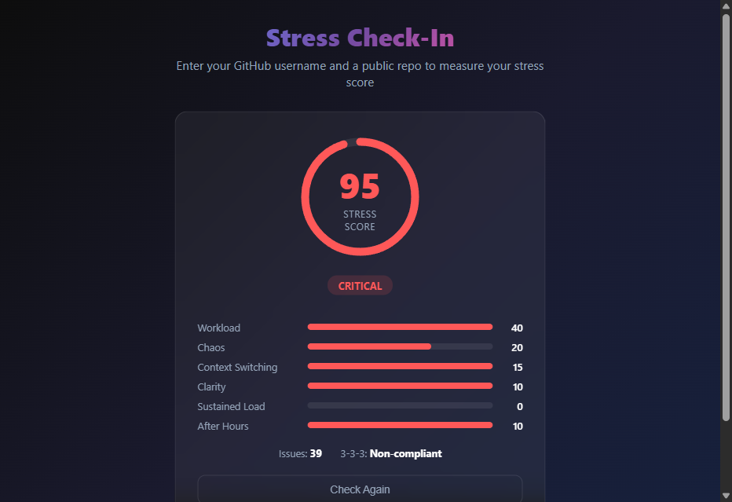
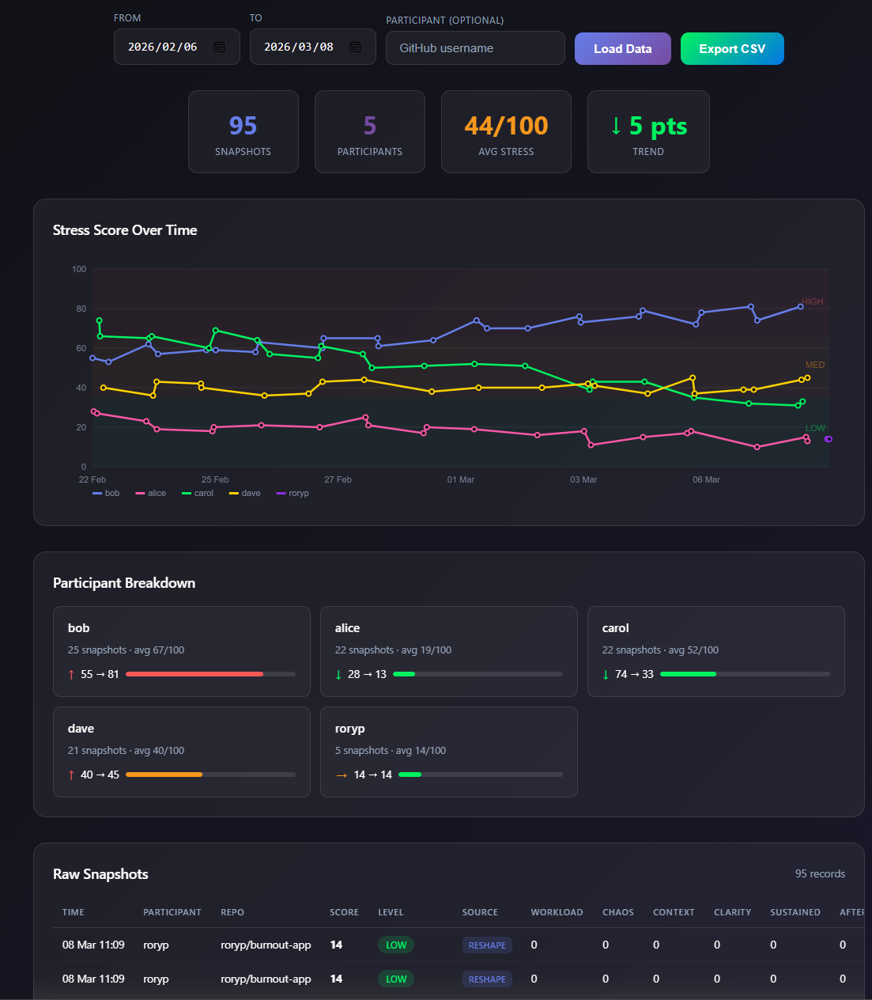

# Burnout-as-a-Service

**AI-powered burnout prevention** for developers — a Java backend (LangChain4j Supervisor Pattern) + MCP App that analyzes your GitHub issues, detects stress signals, and organizes your day using the **3-3-3 structure**: 1 deep work, 3 quick wins, 3 maintenance. See the [Psychology & Science deep-dive](docs/PSYCHOLOGY.md) for the research and algorithms behind every feature.


**Live demo:** [https://aka.ms/burnout-app](https://aka.ms/burnout-app) — enter any public repo and see its burnout flamegraph instantly.

## Flows

### VS Code Flow (MCP Tools)


### Web Flow (No Auth Required)


## How It Works

A **Supervisor LLM** (Azure OpenAI) orchestrates 5 specialized sub-agents that analyze your workload and apply GitHub labels automatically:

| Agent | Action | Labels Applied |
|-------|--------|---------------|
| **DeferAgent** | Push non-critical to next sprint | `deferred`, `next-sprint` |
| **DelegateAgent** | Reassign to balance load | `delegated`, `needs-owner` |
| **ClassifyAgent** | Organize into 3-3-3 buckets | `deep-work`, `quick-win`, `maintenance` |
| **ScopeAgent** | Flag vague issues | `needs-scope`, `blocked` |
| **WellnessAgent** | Recommend breaks & boundaries | *(advisory only)* |

Deterministic services compute all metrics (chaos score, compliance, stress). AI agents only explain and act — they never decide.

## Algorithm Pipeline


> **Full technical deep-dive:** [docs/PSYCHOLOGY.md](docs/PSYCHOLOGY.md) — formulas, thresholds, and the psychology behind every algorithm.

## Quick Start

### Prerequisites

- **GitHub CLI** — `gh auth login` (with `repo` scope)
- **VS Code** with GitHub Copilot
- **Node.js 18+**

### Option A: Deploy to Azure (one command)

```bash
azd auth login
azd up                    # Provisions Container Apps, Azure OpenAI, ACR, PostgreSQL, managed identity
cd mcp-app && npm install && npm run build
```

Create `.env` in the project root:
```env
BACKEND_URL=https://your-backend.wonderfulstone-xxxxx.swedencentral.azurecontainerapps.io
```

### Option B: Run Locally

Requires Java 21+ and Maven. Create `.env`:
```env
AZURE_OPENAI_ENDPOINT=https://your-resource.openai.azure.com
AZURE_OPENAI_API_KEY=your-api-key
AZURE_OPENAI_DEPLOYMENT=gpt-5-mini
BACKEND_URL=http://localhost:8080
```

```bash
cd backend && mvn clean package -DskipTests
java -jar target/burnout-backend-0.0.1-SNAPSHOT.jar
cd ../mcp-app && npm install && npm run build
```

Reload VS Code — the `.vscode/mcp.json` is pre-configured.

## Usage

In VS Code Copilot Chat:

```
Sync issues for owner/repo          # Step 1: fetch your GitHub issues
Show my burnout wheel for owner/repo # Step 2: see the 3-3-3 flamegraph
Reshape my day for owner/repo        # Step 3: AI applies labels automatically
What's my stress score for owner/repo # Quick stress check (0-100)
```

## MCP Tools

| Tool | Description |
|------|-------------|
| `sync_issues` | Fetch issues from GitHub and sync to backend |
| `show_burnout_wheel` | Interactive flamegraph with 3-3-3 plan and stress metrics |
| `reshape_day` | AI-powered workload optimization — applies labels to GitHub |
| `get_stress_score` | Stress score 0–100 (LOW / MODERATE / HIGH / CRITICAL) |

## API Endpoints

| Method | Endpoint | Auth | Description |
|--------|----------|------|-------------|
| POST | `/api/issues/sync` | Yes | Sync issues from MCP app |
| GET | `/api/stress?repo=...&userId=...` | Yes | Get stress analysis |
| POST | `/api/reshape` | Yes | Run full reshape workflow |
| GET | `/demo/api/flamegraph?repo=...` | No | Read-only flamegraph data |
| GET | `/demo/api/repos` | No | List synced repos |
| POST | `/demo/api/sync?repo=owner/repo` | No | Sync from GitHub public API (rate-limited) |
| POST | `/demo/api/seed` | No | Seed test data (**use camelCase fields** — see below) |
| POST | `/demo/api/checkin` | No | Student stress check-in (syncs + records snapshot) |

## Seeding Test Data

The easiest way to seed everything for a demo is the one-command script:

```bash
# Local
bash scripts/seed-demo.sh

# Azure
bash scripts/seed-demo.sh https://your-app.azurecontainerapps.io
```

```powershell
# Windows (local)
.\scripts\seed-demo.ps1

# Windows (Azure)
.\scripts\seed-demo.ps1 -BaseUrl https://your-app.azurecontainerapps.io
```

This seeds 16 issues, runs checkins for 3 users, and generates 14 days of study history.

> **⚠️ Two critical rules when seeding manually:**
> 1. **Use camelCase** field names (`createdAt`, `updatedAt`) — NOT snake_case. Snake_case fields silently deserialize as `null`, causing Context Switching, After Hours, and Sustained Load to show as 0.
> 2. **Use recent timestamps** — metrics are calculated relative to the server's current time. Static/old dates produce zero values.

## Student Check-In

A zero-friction web page for study participants. No VS Code, no CLI, no auth — just a browser.

**URL:** `https://<your-app>.azurecontainerapps.io/checkin.html`



1. Student enters their GitHub username and a **public** repo
2. Optionally sets the **self-report slider** (0–100: "How stressed do you feel?") and **notes**
3. Clicks **"Check My Stress"**
4. Sees their computed stress score + breakdown — snapshot is recorded automatically

The check-in compares **objective stress** (computed from GitHub signals) with **subjective stress** (self-reported), enabling researchers to study the gap between perceived and actual workload pressure.

### Stress Breakdown

Each check-in calculates six stress dimensions from GitHub issue signals. **Hover over any metric** to see why that score was given.

| Metric | What it measures | Max |
|--------|-----------------|-----|
| **Workload** | Too many assigned issues, multiple deep-work items | 40 |
| **Chaos** | Label conflicts, missing assignees, scope creep | 30 |
| **Context Switching** | Issues touched today > 5 (constant interrupts) | 15 |
| **Clarity** | "Mystery meat" issues — no labels, no body | 10 |
| **Sustained Load** | Consecutive high-chaos days | 15 |
| **After Hours** | Issues updated outside 9am–6pm | 10 |

Score is capped at 100. Levels: **LOW** (0–29), **MODERATE** (30–49), **HIGH** (50–69), **CRITICAL** (70+).

## Study Dashboard

A researcher-facing web page for tracking stress score trends over time, built for a longitudinal burnout study.

**Live:** `https://<your-app>.azurecontainerapps.io/study.html`



### What it does

Every call to `get_stress_score`, `reshape_day`, or the **check-in page** automatically persists a stress snapshot to **Azure Database for PostgreSQL**. The study dashboard visualizes these accumulated snapshots with:

- **Summary cards** — total snapshots, unique participants, average stress, trend direction
- **Stress trend chart** — per-participant line chart with HIGH/MED/LOW color zones
- **Participant breakdown** — tiles per user showing count, avg score, and trend arrow. **Click any participant** to open their stress check-in with full breakdown and hover tooltips.
- **Raw data table** — all snapshots with full stress breakdown columns. **Hover over any metric** to see what it measures. **Click a username** to view their live stress check-in.
- **CSV export** — one-click download for offline analysis (includes `selfReportedScore` and `selfReportedNote` columns)

### Setup

PostgreSQL is provisioned automatically by `azd up` (see `infra/modules/postgresql.bicep`). The backend auto-creates the `stress_snapshots` table via JPA on first startup.

To seed dummy data for demos (4 users, 14 days, ~90 snapshots):

```bash
curl -X POST https://<your-app>/demo/api/study/seed
```

### Study API endpoints

| Method | Endpoint | Auth | Description |
|--------|----------|------|-------------|
| GET | `/demo/api/study/snapshots?from=YYYY-MM-DD&to=YYYY-MM-DD` | No | JSON snapshots (optional `userId` filter) |
| GET | `/demo/api/study/export?from=YYYY-MM-DD&to=YYYY-MM-DD` | No | CSV download (optional `userId` filter) |
| POST | `/demo/api/study/seed` | No | Seed dummy data for demos |

## Security

GitHub token authentication — MCP app retrieves your token via `gh auth token`, passes it as a Bearer header, and the backend validates it against the GitHub API. Tokens are cached for 5 minutes. Security is enabled by default; CORS is restricted to Azure Container Apps, VS Code, and localhost.

## Troubleshooting

| Issue | Solution |
|-------|----------|
| MCP tools disabled | Reload VS Code (`Ctrl+Shift+P` → Reload Window) |
| 401 Unauthorized | Run `gh auth login` with `repo` scope |
| Issues not showing | Run `sync_issues` first |
| .env changes not picked up | Restart the MCP server in VS Code |

## License

MIT
