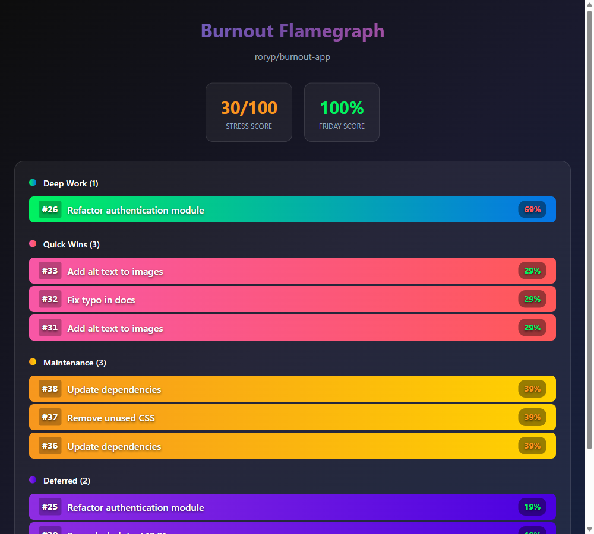

# Burnout-as-a-Service

**AI-powered burnout prevention** for developers — a Java backend (LangChain4j Supervisor Pattern) + MCP App that analyzes your GitHub issues, detects stress signals, and organizes your day using the **3-3-3 structure**: 1 deep work, 3 quick wins, 3 maintenance. See the [Psychology & Science deep-dive](docs/PSYCHOLOGY.md) for the research and algorithms behind every feature.



**Live demo:** [https://aka.ms/burnout-app](https://aka.ms/burnout-app) — enter any public repo and see its burnout flamegraph instantly.

## How It Works

A **Supervisor LLM** (Azure OpenAI) orchestrates 5 specialized sub-agents that analyze your workload and apply GitHub labels automatically:

| Agent | Action | Labels Applied |
|-------|--------|---------------|
| **DeferAgent** | Push non-critical to next sprint | `deferred`, `next-sprint` |
| **DelegateAgent** | Reassign to balance load | `delegated`, `needs-owner` |
| **ClassifyAgent** | Organize into 3-3-3 buckets | `deep-work`, `quick-win`, `maintenance` |
| **ScopeAgent** | Flag vague issues | `needs-scope`, `blocked` |
| **WellnessAgent** | Recommend breaks & boundaries | *(advisory only)* |

Deterministic services compute all metrics (chaos score, compliance, stress). AI agents only explain and act — they never decide.

## Algorithm Pipeline


> **Full technical deep-dive:** [docs/PSYCHOLOGY.md](docs/PSYCHOLOGY.md) — formulas, thresholds, and the psychology behind every algorithm.

## Quick Start

### Prerequisites

- **GitHub CLI** — `gh auth login` (with `repo` scope)
- **VS Code** with GitHub Copilot
- **Node.js 18+**

### Option A: Deploy to Azure (one command)

```bash
azd auth login
azd up                    # Provisions Container Apps, Azure OpenAI, ACR, managed identity
cd mcp-app && npm install && npm run build
```

Create `.env` in the project root:
```env
BACKEND_URL=https://your-backend.wonderfulstone-xxxxx.swedencentral.azurecontainerapps.io
```

### Option B: Run Locally

Requires Java 21+ and Maven. Create `.env`:
```env
AZURE_OPENAI_ENDPOINT=https://your-resource.openai.azure.com
AZURE_OPENAI_API_KEY=your-api-key
AZURE_OPENAI_DEPLOYMENT=gpt-5-mini
BACKEND_URL=http://localhost:8080
```

```bash
cd backend && mvn clean package -DskipTests
java -jar target/burnout-backend-0.0.1-SNAPSHOT.jar
cd ../mcp-app && npm install && npm run build
```

Reload VS Code — the `.vscode/mcp.json` is pre-configured.

## Usage

In VS Code Copilot Chat:

```
Sync issues for owner/repo          # Step 1: fetch your GitHub issues
Show my burnout wheel for owner/repo # Step 2: see the 3-3-3 flamegraph
Reshape my day for owner/repo        # Step 3: AI applies labels automatically
What's my stress score for owner/repo # Quick stress check (0-100)
```

## MCP Tools

| Tool | Description |
|------|-------------|
| `sync_issues` | Fetch issues from GitHub and sync to backend |
| `show_burnout_wheel` | Interactive flamegraph with 3-3-3 plan and stress metrics |
| `reshape_day` | AI-powered workload optimization — applies labels to GitHub |
| `get_stress_score` | Stress score 0–100 (LOW / MODERATE / HIGH / CRITICAL) |

## API Endpoints

| Method | Endpoint | Auth | Description |
|--------|----------|------|-------------|
| POST | `/api/issues/sync` | Yes | Sync issues from MCP app |
| GET | `/api/stress?repo=...&userId=...` | Yes | Get stress analysis |
| POST | `/api/reshape` | Yes | Run full reshape workflow |
| GET | `/demo/api/flamegraph?repo=...` | No | Read-only flamegraph data |
| GET | `/demo/api/repos` | No | List synced repos |
| POST | `/demo/api/sync?repo=owner/repo` | No | Sync from GitHub public API (rate-limited) |
| POST | `/demo/api/seed` | No | Seed test data |

## Security

GitHub token authentication — MCP app retrieves your token via `gh auth token`, passes it as a Bearer header, and the backend validates it against the GitHub API. Tokens are cached for 5 minutes. Security is enabled by default; CORS is restricted to Azure Container Apps, VS Code, and localhost.

## Troubleshooting

| Issue | Solution |
|-------|----------|
| MCP tools disabled | Reload VS Code (`Ctrl+Shift+P` → Reload Window) |
| 401 Unauthorized | Run `gh auth login` with `repo` scope |
| Issues not showing | Run `sync_issues` first |
| .env changes not picked up | Restart the MCP server in VS Code |

## License

MIT
