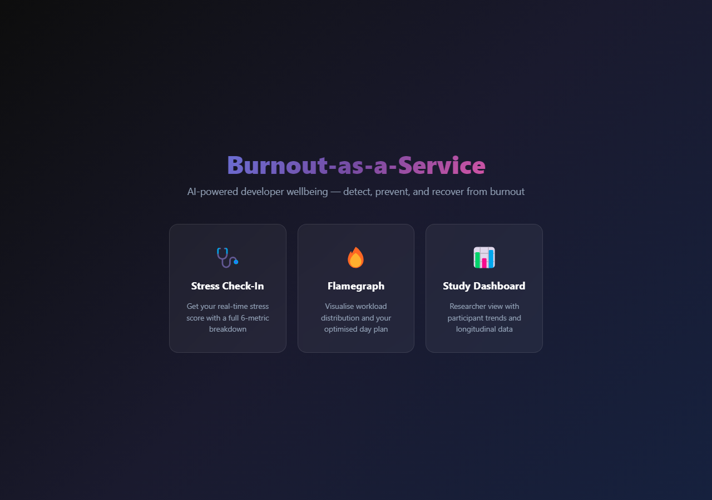
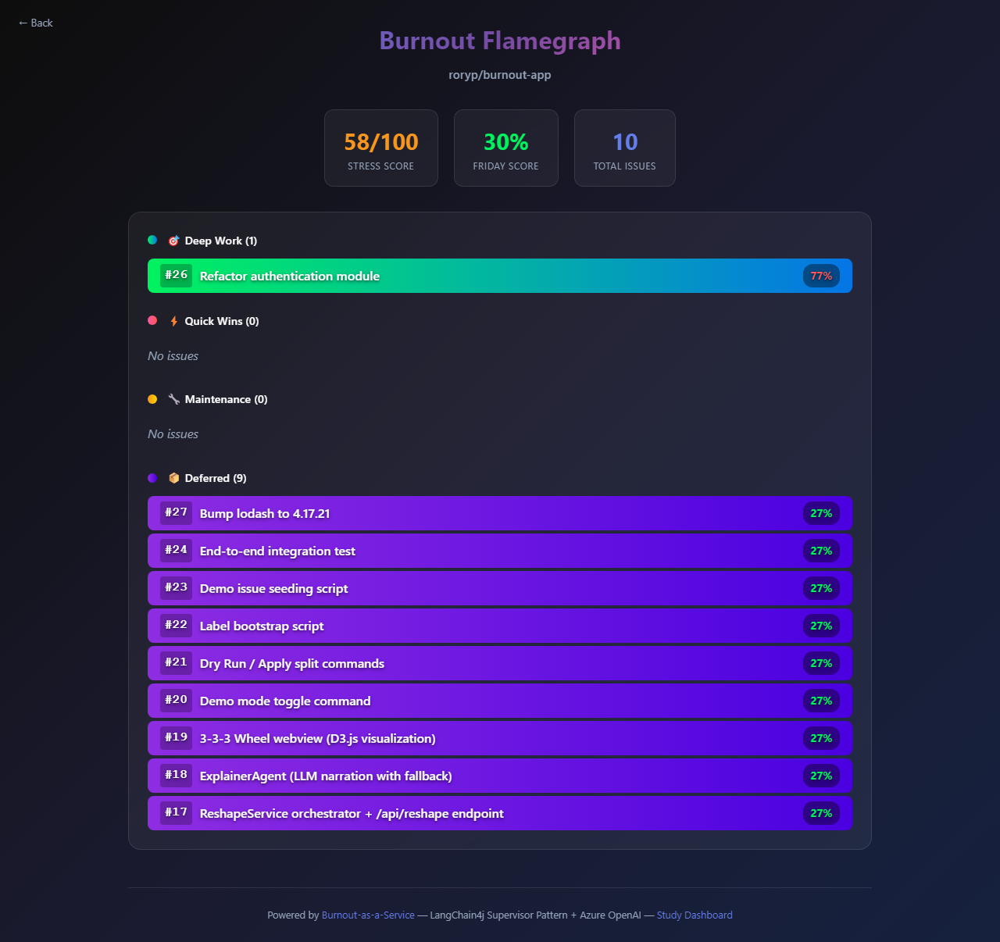
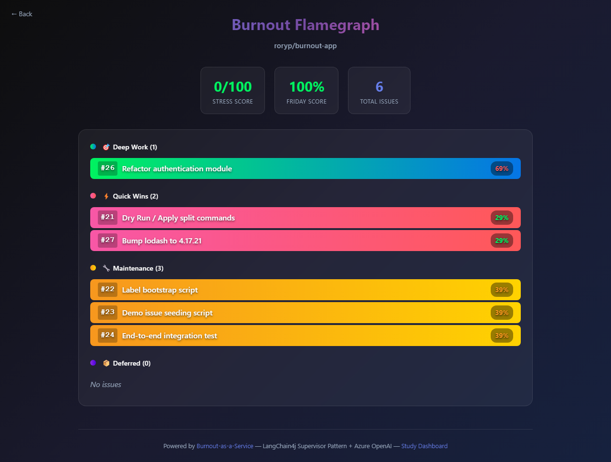
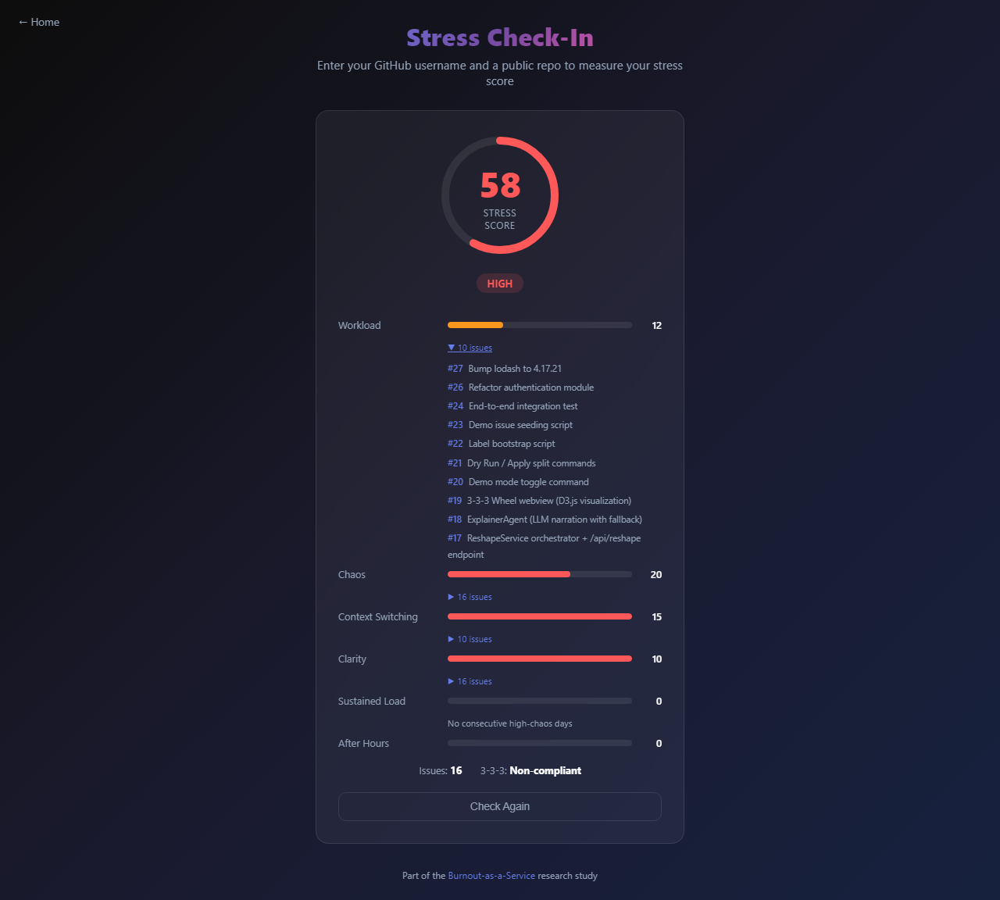
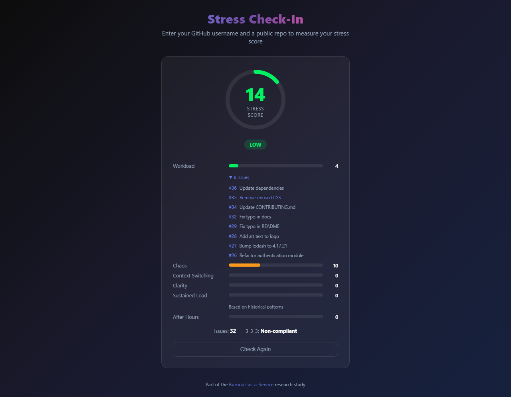
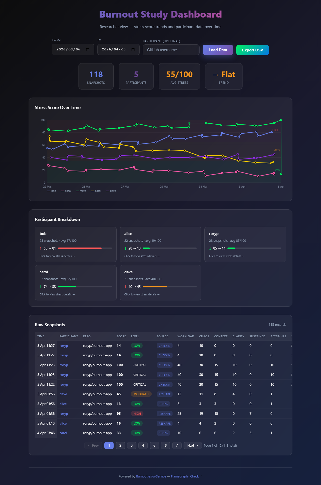
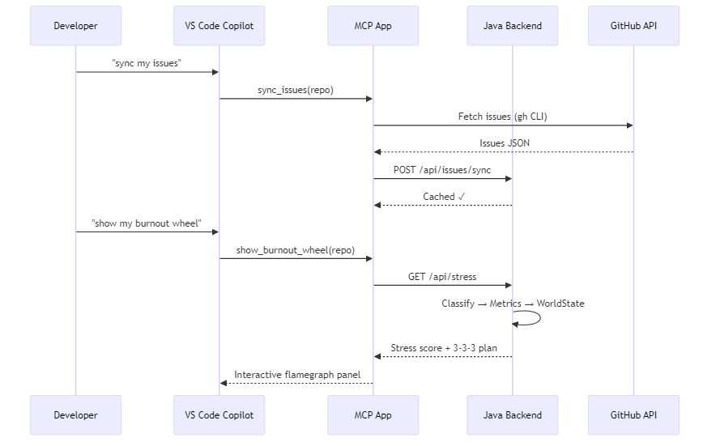
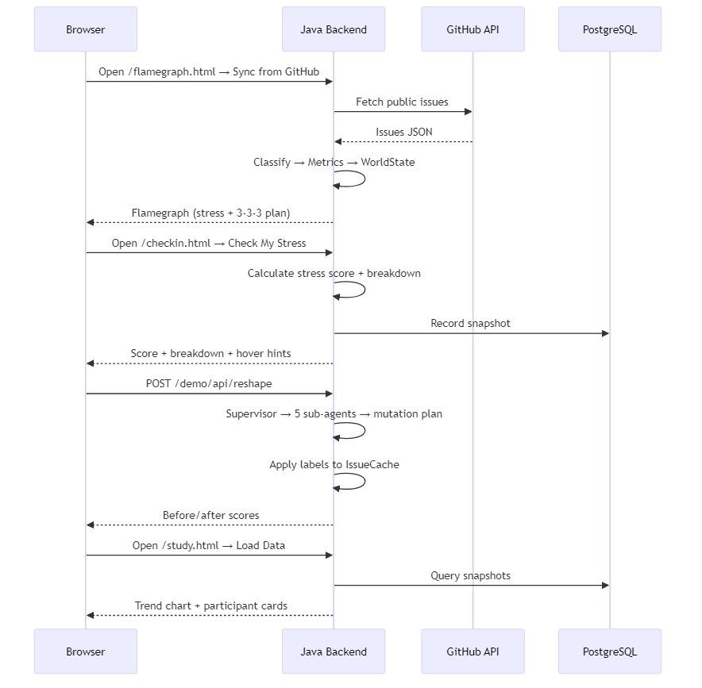
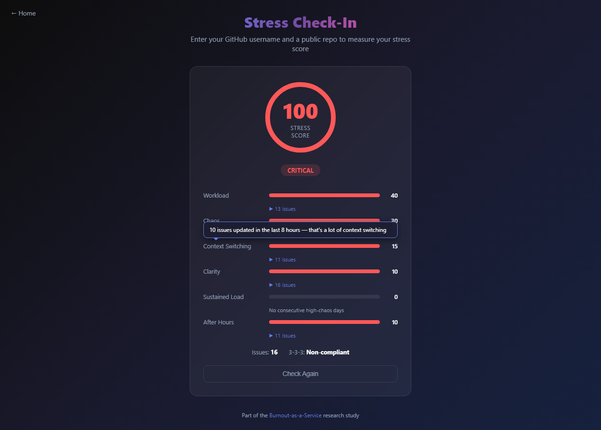
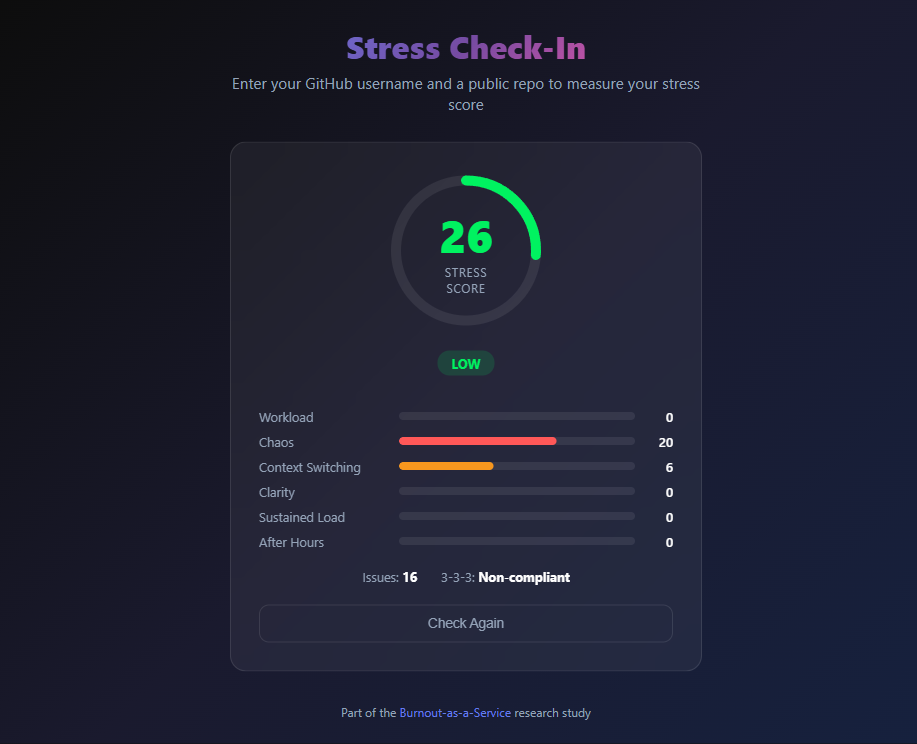

# Burnout-as-a-Service

**AI-powered burnout prevention** for developers — a Java backend (LangChain4j Supervisor Pattern) + MCP App that analyzes your GitHub issues, detects stress signals, and organizes your day using the **3-3-3 structure**: 1 deep work, 3 quick wins, 3 maintenance. See the [Psychology & Science deep-dive](docs/PSYCHOLOGY.md) for the research and algorithms behind every feature.


**Live demo:** [https://aka.ms/burnout-app](https://aka.ms/burnout-app) — enter any public repo and see its burnout flamegraph instantly.

## See It In Action

Four pages, no auth required:

| Page | URL | What you see |
|------|-----|-------------|
| **Home** | `/` | Landing page with links to all pages |
| **Flamegraph** | `/flamegraph.html?repo=roryp/burnout-app` | 3-3-3 day plan, stress score, per-issue heat |
| **Check-In** | `/checkin.html` | Stress breakdown with self-report slider |
| **Study Dashboard** | `/study.html` | Trend chart, 5 participants, raw data table |



### Before / After

| Before (Chaotic) | After (Reshaped) |
|:---:|:---:|
|  |  |
| 58/100 stress (HIGH), Workload + Chaos + Context Switching firing | 8/100 stress (LOW), 100% Friday Score, 3-3-3 compliant |

### Stress Breakdown: What Changed

| Before (58/HIGH) | After (8/LOW) |
|:---:|:---:|
|  |  |

| Metric | Before | After | What changed |
|--------|--------|-------|-------------|
| **Workload** | 12 | 8 | 10 issues piled on roryp → reshape deferred most into 3-3-3, leaving 1 deep-work item |
| **Chaos** | 20 | 0 | 6 unassigned URGENTs + empty bodies + after-hours timestamps → deterministic pre-pass triaged them and defused chaos inputs |
| **Context Switching** | 15 | 0 | 10 issues touched in the last hour → updatedAt rewritten to a stable mid-morning slot |
| **Clarity** | 10 | 0 | Every issue had an empty body → SetBody actions added scope-pending placeholders |
| **After Hours** | 0 | 0 | Chaos issues had 3AM / 4AM / 10PM timestamps but were unassigned, so they didn't count against roryp |
| **Sustained** | 0 | 0 | No prior high-stress days yet (this is a fresh seed) |

> **Note:** The reshape uses an LLM supervisor, so results vary slightly run-to-run. Typical: **58 → 8 (LOW)** with ~70-80 actions applied. Occasionally lands on 0 when the supervisor classifies the final remaining issue too.

**How to get there:**

```bash
# 1. Seed chaotic issues (real GitHub titles + chaos overlay → stress 58 / HIGH)
bash scripts/seed-demo.sh https://your-app.azurecontainerapps.io
# or PowerShell:
.\scripts\seed-demo.ps1 -BaseUrl https://your-app.azurecontainerapps.io

# 2. Reshape — runs the deterministic pre-pass + LangChain4j supervisor:
curl -X POST https://your-app.azurecontainerapps.io/demo/api/reshape \
  -H 'Content-Type: application/json' \
  -d '{"repo":"roryp/burnout-app","userId":"roryp"}'
# → beforeScore 58, afterScore 8 (typical, sometimes 0), actionsApplied ~75, llmUsed true

# 3. View the result:
#    /flamegraph.html?repo=roryp/burnout-app&userId=roryp  → 8/100 stress, 3-3-3 compliant
#    /study.html → click Load Data → see roryp's drop in the trend chart
```



## Flows

### VS Code Flow (MCP Tools)



### Web Flow (No Auth Required)



## How It Works

Reshape runs in two phases. **Phase 1** is a deterministic pre-pass that fires before the LLM ever wakes up — it triages every unassigned-urgent issue and defuses chaos inputs (empty bodies, after-hours timestamps, recent-touch storms) so the chaos score is guaranteed to drop. **Phase 2** is a **Supervisor LLM** (Azure OpenAI) coordinating 6 specialized sub-agents (`maxAgentsInvocations: 15`) that finish the rebalancing and apply GitHub labels:

| Agent | Action | Labels Applied |
|-------|--------|---------------|
| **TriageAgent** | Strip urgent flags from unassigned issues | `triaged`, `backlog` |
| **DeferAgent** | Push non-critical to next sprint | `deferred`, `next-sprint` |
| **DelegateAgent** | Reassign to balance load | `delegated`, `needs-owner` |
| **ClassifyAgent** | Organize into 3-3-3 buckets | `deep-work`, `quick-win`, `maintenance` |
| **ScopeAgent** | Flag vague issues | `needs-scope`, `blocked` |
| **WellnessAgent** | Recommend breaks & boundaries | *(advisory only)* |

Deterministic services compute all metrics (chaos score, compliance, stress). The pre-pass guarantees a chaos drop even if the LLM picks the wrong agent. AI agents only explain and act — they never decide.

The reshape returns a [`GitHubMutationPlan`](backend/src/main/java/com/demo/burnout/goap/GitHubMutationPlan.java) of six action types: `AddLabels`, `RemoveLabels`, `Comment`, `Unassign`, `SetBody`, and `SetUpdatedAt`.

## Algorithm Pipeline


> **Full technical deep-dive:** [docs/PSYCHOLOGY.md](docs/PSYCHOLOGY.md) — formulas, thresholds, and the psychology behind every algorithm.

## Quick Start

### Prerequisites

- **GitHub CLI** — `gh auth login` (with `repo` scope)
- **VS Code** with GitHub Copilot
- **Node.js 18+**

### Option A: Deploy to Azure (one command)

```bash
azd auth login
azd up                    # Provisions Container Apps, Azure OpenAI, ACR, PostgreSQL, managed identity
```

Then seed demo data and verify (the in-memory cache is empty after every deploy):

```powershell
.\scripts\seed-demo.ps1 -BaseUrl https://your-app.azurecontainerapps.io   # seed issues + checkins + study data
.\scripts\smoke-test.ps1 -BaseUrl https://your-app.azurecontainerapps.io  # 26 assertions, all should pass
```

```bash
# Or on Mac/Linux:
bash scripts/seed-demo.sh https://your-app.azurecontainerapps.io
```

Build the MCP app for VS Code integration:
```bash
cd mcp-app && npm install && npm run build
```

Create `.env` in the project root:
```env
BACKEND_URL=https://your-backend.wonderfulstone-xxxxx.swedencentral.azurecontainerapps.io
```

### Option B: Run Locally

Requires Java 21+ and Maven. Create `.env`:
```env
AZURE_OPENAI_ENDPOINT=https://your-resource.openai.azure.com
AZURE_OPENAI_API_KEY=your-api-key
AZURE_OPENAI_DEPLOYMENT=gpt-5-mini
BACKEND_URL=http://localhost:8080
```

```bash
cd backend && mvn clean package -DskipTests
java -jar target/burnout-backend-0.0.1-SNAPSHOT.jar
cd ../mcp-app && npm install && npm run build
```

Reload VS Code — the `.vscode/mcp.json` is pre-configured.

## Usage

In VS Code Copilot Chat:

```
Sync issues for owner/repo          # Step 1: fetch your GitHub issues
Show my burnout wheel for owner/repo # Step 2: see the 3-3-3 flamegraph
Reshape my day for owner/repo        # Step 3: AI applies labels automatically
What's my stress score for owner/repo # Quick stress check (0-100)
```

## MCP Tools

| Tool | Description |
|------|-------------|
| `sync_issues` | Fetch issues from GitHub and sync to backend |
| `show_burnout_wheel` | Interactive flamegraph with 3-3-3 plan and stress metrics |
| `reshape_day` | AI-powered workload optimization — applies labels to GitHub |
| `get_stress_score` | Stress score 0–100 (LOW / MODERATE / HIGH / CRITICAL) |

## API Endpoints

| Method | Endpoint | Auth | Description |
|--------|----------|------|-------------|
| POST | `/api/issues/sync` | Yes | Sync issues from MCP app |
| GET | `/api/stress?repo=...&userId=...` | Yes | Get stress analysis |
| POST | `/api/reshape` | Yes | Run full reshape workflow |
| GET | `/demo/api/flamegraph?repo=...` | No | Read-only flamegraph data |
| GET | `/demo/api/repos` | No | List synced repos |
| POST | `/demo/api/sync?repo=owner/repo` | No | Sync from GitHub public API (rate-limited) |
| POST | `/demo/api/seed` | No | Seed test data (**use camelCase fields** — see below) |
| POST | `/demo/api/reshape` | No | Run reshape (deterministic pre-pass + LangChain4j supervisor), apply mutations to cache |
| POST | `/demo/api/checkin` | No | Student stress check-in — accepts optional `tz` param for timezone-aware after-hours (syncs + records snapshot) |

## Seeding & Demo Data

The seed script populates everything needed for a live demo — 16 issues, checkins, and 14 days of study history for 5 participants (alice, bob, carol, dave, roryp):

```bash
bash scripts/seed-demo.sh https://your-app.azurecontainerapps.io           # seed BEFORE (chaotic)
bash scripts/seed-demo.sh https://your-app.azurecontainerapps.io after      # seed + reshape (AFTER)
```

```powershell
.\scripts\seed-demo.ps1 -BaseUrl https://your-app.azurecontainerapps.io              # seed BEFORE
.\scripts\seed-demo.ps1 -BaseUrl https://your-app.azurecontainerapps.io -Mode after  # seed + reshape
```

The **AFTER** mode seeds chaotic issues then calls the real `/demo/api/reshape` endpoint, which runs the **deterministic pre-pass** (`triageUrgent` + `defuseChaosInputs`) followed by the **LangChain4j supervisor** with 6 sub-agents to restructure the workload. No hardcoded data — every action comes from real code or the LLM.

<details>
<summary><strong>⚠️ Manual seeding rules</strong></summary>

1. **Use camelCase** field names (`createdAt`, `updatedAt`) — NOT snake_case. Snake_case fields silently deserialize as `null`, causing Context Switching, After Hours, and Sustained Load to show as 0.
2. **Use recent timestamps** — metrics are calculated relative to the server's current time. Static/old dates produce zero values.

</details>

## Student Check-In

A zero-friction web page for study participants. No VS Code, no CLI, no auth — just a browser.

**URL:** `https://<your-app>.azurecontainerapps.io/checkin.html`

| Before (Chaotic) | After (Reshaped) |
|:---:|:---:|
|  |  |
| Stress 58, HIGH — workload + chaos firing | Stress 8, LOW — most bars zeroed |

1. Student enters their GitHub username and a **public** repo
2. Optionally sets the **self-report slider** (0–100: "How stressed do you feel?") and **notes**
3. Clicks **"Check My Stress"**
4. Sees their computed stress score + breakdown — **click any metric** to drill down into the specific issues causing that score
5. Each issue links directly to GitHub — snapshot is recorded automatically

The check-in compares **objective stress** (computed from GitHub signals) with **subjective stress** (self-reported), enabling researchers to study the gap between perceived and actual workload pressure.

### Stress Breakdown

Each check-in calculates six stress dimensions from GitHub issue signals. **Hover over any metric** to see why that score was given. **Click the issue count** below any metric to expand a list of the specific GitHub issues driving that score — each issue links directly to GitHub.

| Metric | What it measures | Scope | Max |
|--------|-----------------|-------|-----|
| **Workload** | Too many assigned issues, multiple deep-work items | user | 40 |
| **Chaos** | Label conflicts, missing assignees, scope creep | **repo-wide** | 30 |
| **Context Switching** | Issues touched today > 5 (constant interrupts) | user | 15 |
| **Clarity** | "Mystery meat" issues — no labels, no body | user | 10 |
| **Sustained Load** | Consecutive high-chaos days | user | 15 |
| **After Hours** | Issues updated outside 9am–6pm in your timezone (weekends included) | user | 10 |

Score is capped at 100. Levels: **LOW** (0–29), **MODERATE** (30–49), **HIGH** (50–69), **CRITICAL** (70+).

> **Scope note:** **Chaos** is computed across **all open issues in the repo** (any assignee or none) — the assumption is that working in a chaotic repo is itself stressful, even when the noisy issues aren't yours. Every other metric only counts issues assigned to you.

## Study Dashboard

A researcher-facing web page for tracking stress score trends over time, built for a longitudinal burnout study.

**Live:** `https://<your-app>.azurecontainerapps.io/study.html`


### What it does

Every call to `get_stress_score`, `reshape_day`, or the **check-in page** automatically persists a stress snapshot to **Azure Database for PostgreSQL**. The study dashboard visualizes these accumulated snapshots with:

- **Summary cards** — total snapshots, unique participants, average stress, trend direction
- **Stress trend chart** — per-participant line chart with HIGH/MED/LOW color zones
- **Participant breakdown** — tiles per user showing count, avg score, and trend arrow. **Click any participant** to open their stress check-in with full breakdown and hover tooltips.
- **Raw data table** — all snapshots with full stress breakdown columns. **Hover over any metric** to see what it measures. **Click a username** to view their live stress check-in.
- **CSV export** — one-click download for offline analysis (includes `selfReportedScore` and `selfReportedNote` columns)

### Setup

PostgreSQL is provisioned automatically by `azd up` (see `infra/modules/postgresql.bicep`). The backend auto-creates the `stress_snapshots` table via JPA on first startup.

To seed dummy data for demos (5 users, 14 days, ~113 snapshots):

```bash
curl -X POST https://<your-app>/demo/api/study/seed
```

### Study API endpoints

| Method | Endpoint | Auth | Description |
|--------|----------|------|-------------|
| GET | `/demo/api/study/snapshots?from=YYYY-MM-DD&to=YYYY-MM-DD` | No | JSON snapshots (optional `userId` filter) |
| GET | `/demo/api/study/export?from=YYYY-MM-DD&to=YYYY-MM-DD` | No | CSV download (optional `userId` filter) |
| POST | `/demo/api/study/seed` | No | Seed dummy data for demos |

## Demo Screenshots

Capture a full set of before/after screenshots for presentations:

```powershell
.\scripts\demo-screenshots.ps1                                                    # auto-discovers Azure URL
.\scripts\demo-screenshots.ps1 -BaseUrl https://your-app.azurecontainerapps.io     # explicit URL
```

```bash
bash scripts/demo-screenshots.sh                                                  # auto-discovers Azure URL
bash scripts/demo-screenshots.sh https://your-app.azurecontainerapps.io            # explicit URL
```

The scripts seed BEFORE data, capture screenshots, run the deterministic pre-pass + LangChain4j supervisor via `/demo/api/reshape`, then capture AFTER + study screenshots. Saved to `docs/images/demo/`.

## Security

GitHub token authentication — MCP app retrieves your token via `gh auth token`, passes it as a Bearer header, and the backend validates it against the GitHub API. Tokens are cached for 5 minutes. Security is enabled by default; CORS is restricted to Azure Container Apps, VS Code, and localhost.

## GitHub Access: `gh` CLI vs GitHub REST API

The project uses both the `gh` CLI and direct calls to the GitHub REST API, depending on whether the action is performed on behalf of an authenticated user or by the backend itself.

| Component | Uses | Endpoint / Command | Purpose |
|---|---|---|---|
| `mcp-app/src/backend-client.ts` (token retrieval) | `gh` CLI | `gh auth token` | Get the user's GitHub token to pass as Bearer to the backend |
| `mcp-app/src/backend-client.ts` (issue sync) | `gh` CLI | `gh issue list --repo ... --json ...` | Fetch the user's issues for the `sync_issues` MCP tool |
| `mcp-app/src/backend-client.ts` (label mutations) | `gh` CLI | `gh issue edit <n> --repo ...` | Apply label changes during `reshape_day` |
| `scripts/seed-issues.sh`, `scripts/setup-labels.sh` | `gh` CLI | `gh issue create`, `gh label create` | Seed real GitHub issues/labels for live repos |
| `backend` `DemoFlamegraphController.java` (`/demo/api/sync`) | GitHub REST API | `GET https://api.github.com/repos/{repo}/issues` | Unauthenticated public sync for the demo web app (rate-limited 1/5min/repo) |
| `backend` `SecurityConfig.java` (token validation) | GitHub REST API | `GET https://api.github.com/user` | Validate Bearer tokens from MCP / `/api/**` callers (cached 5 min) |
| `scripts/record-demo.mjs` | GitHub REST API | `GET https://api.github.com/repos/{repo}/issues` | Cache real issues during demo video recording |

Rule of thumb: the **`gh` CLI is used wherever an authenticated user action is needed** (MCP app + setup scripts), while the **GitHub REST API is called directly** when the backend needs server-to-GitHub access — public demo sync, token validation, and the demo recorder.

## Troubleshooting

| Issue | Solution |
|-------|----------|
| MCP tools disabled | Reload VS Code (`Ctrl+Shift+P` → Reload Window) |
| 401 Unauthorized | Run `gh auth login` with `repo` scope |
| Issues not showing | Run `sync_issues` first |
| .env changes not picked up | Restart the MCP server in VS Code |

## License

MIT
