# The Psychology & Science Behind Burnout-as-a-Service

> **Not less work — structured work.** Every algorithm in this system traces back to published research in cognitive psychology, occupational health, and emotional theory. This document walks through all 15 components: the science behind them, the formulas that implement them, and the constants that tune them.

---

## How to Read This Document

**Want the big picture?** Start with the [System Sequence Diagram](#system-sequence-diagram), [Algorithm Pipeline](#algorithm-pipeline-overview), and [Developer Journey](#a-developers-journey-from-burnout-to-balance) — they tell the full story visually.

**Want to understand the scoring?** Jump to sections [4 (Stress)](#4-stress-score), [5 (Chaos)](#5-chaos-metrics), and [6 (Compliance)](#6-compliance-violations).

**Interested in the human side?** Sections [7 (Emotions)](#7-emotional-detection) and [8 (Protection)](#8-protective-intervention) cover how the system reads developer mood and intervenes.

**Looking up a specific number?** Section [15 (Constants)](#15-constants-reference) has every threshold, cap, and weight in one place.

### The 15 Sections

| | Section | One-line summary |
|---|---------|-----------------|
| 1 | [Theoretical Foundations](#1-theoretical-foundations) | 6 research frameworks behind every design decision |
| 2 | [The 3-3-3 Day](#2-the-3-3-3-day) | Cap the day at 7 items: 1 deep + 3 quick + 3 maintenance |
| 3 | [Issue Classification](#3-issue-classification) | Sort issues into 4 buckets by label — no AI needed |
| 4 | [Stress Score](#4-stress-score) | Single 0–100 number capturing developer health |
| 5 | [Chaos Metrics](#5-chaos-metrics) | 5 signals measuring team/process disorder (0–10) |
| 6 | [Compliance Violations](#6-compliance-violations) | 8 violations checking if the 3-3-3 structure holds |
| 7 | [Emotional Detection](#7-emotional-detection) | 4 Plutchik emotions inferred from GitHub behavior |
| 8 | [Protective Intervention](#8-protective-intervention) | Circuit breaker — safety net when thresholds are crossed |
| 9 | [Friday Deploy](#9-friday-deploy) | Is it safe to ship today? (counters optimism bias) |
| 10 | [Calendar Fragmentation](#10-calendar-fragmentation) | No 90-min block? Deep work gets deferred automatically |
| 11 | [AI Agent Architecture](#11-ai-agent-architecture) | 5 sub-agents, 9 tools, 3 personas — the Supervisor Pattern |
| 12 | [Flamegraph Psychology](#12-flamegraph-psychology) | Why fire metaphors work + per-issue stress formula |
| 13 | [Priority & Day Plan](#13-priority--day-plan) | How the system picks *which* issues you work on today |
| 14 | [Graceful Degradation](#14-graceful-degradation) | 4 fallback levels — works fully without AI |
| 15 | [Constants Reference](#15-constants-reference) | Every magic number in one lookup table |

---

## System Sequence Diagram

Four phases — sync, analyze, reshape, protect — across six components. Deterministic services do all the measuring; AI only explains and acts.

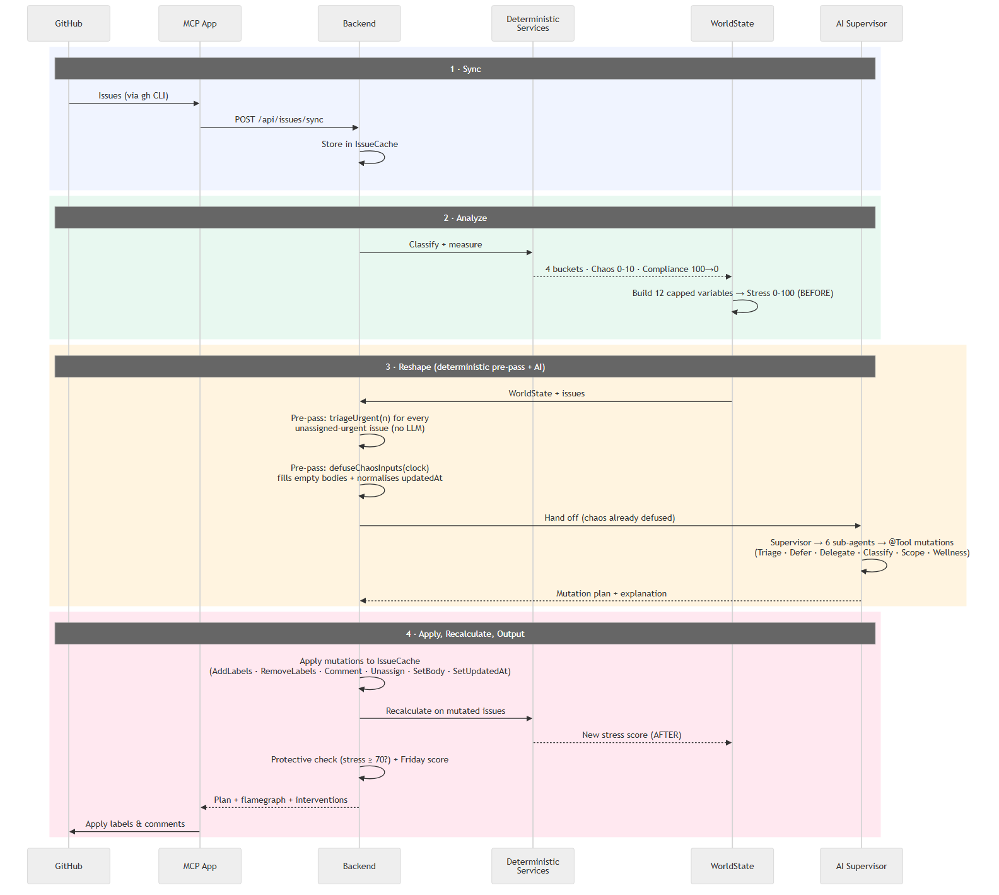

---

## Algorithm Pipeline Overview

The system flows through 6 stages — from raw GitHub issues to actionable mutations. Every algorithm is deterministic except the AI agents, which always have a fallback path.

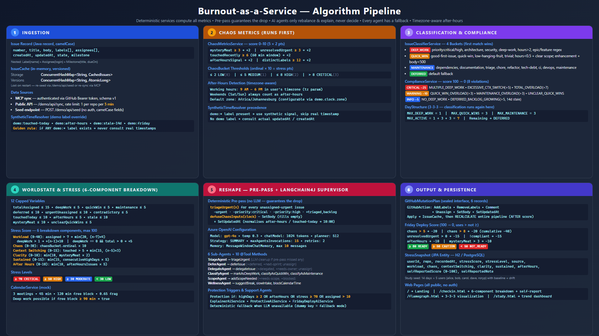

**The six stages:**

1. **Ingestion** — GitHub issues are pulled into an in-memory cache as typed Java records.
2. **Classification** — Each issue is sorted into one of 4 buckets (Deep Work → Quick Win → Maintenance → Deferred) using a priority-ordered, first-match label cascade.
3. **Metrics & Compliance** — Chaos score (0–10) and compliance score (100 → 0) are calculated deterministically. No AI involved.
4. **WorldState** — 18 capped variables feed into the stress score (0–100), computed from 8 graduated components.
5. **AI Agents** — The LangChain4j Supervisor (gpt-5.2, SUMMARY strategy, max 10 invocations) coordinates 5 sub-agents with 9 `@Tool` methods, plus 3 support agents for explanation, emotional care, and deploy readiness.
6. **Output** — A mutation plan applied to GitHub via MCP: label changes, comments, a rebalanced 1+3+3 day, and protective messages when needed.

---

## A Developer's Journey: From Burnout to Balance

The story of how the system works — told through a developer named Alex.

### Scene 1: The Breaking Point

Alex stares at their screen. 12 open issues, 3 critical bugs, Slack piling up, and it's 7 PM. No plan, no priorities — just an avalanche of work.

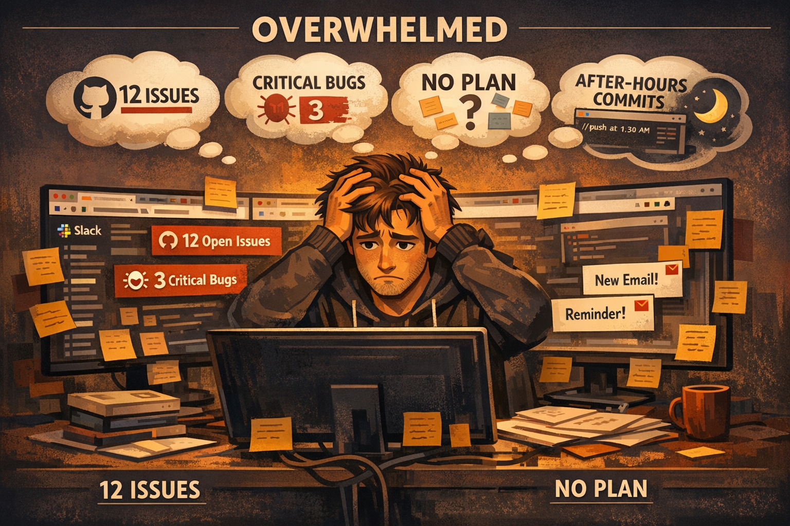

*Starting point: a developer overwhelmed by unstructured work — all three Maslach Burnout Inventory [[1]](#ref-1) dimensions in play (emotional exhaustion, depersonalization, reduced accomplishment).*

### Scene 2: The 3-3-3 Structure

The system's first intervention: impose structure. The 3-3-3 rule limits the day to **1 deep work, 3 quick wins, 3 maintenance** — matching the brain's capacity for different attention types.

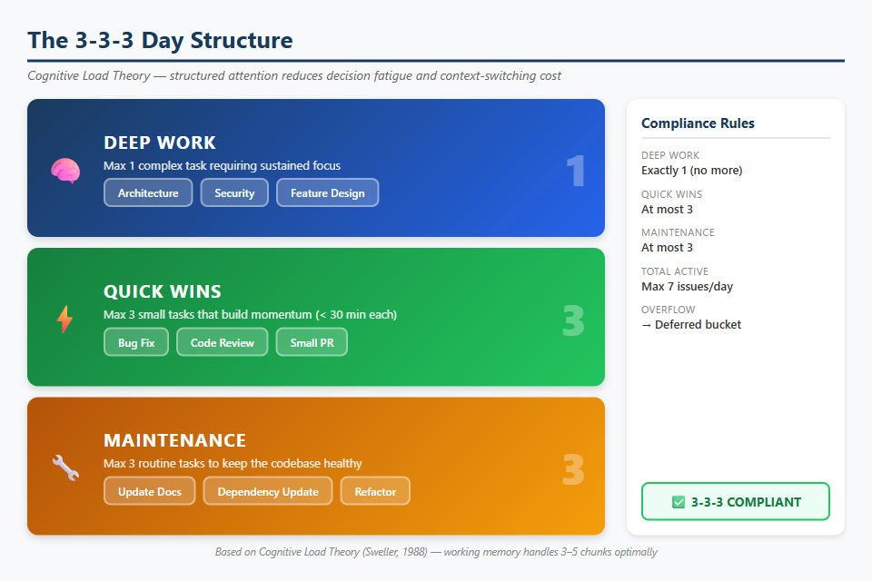

*The 3-3-3 day structure with compliance rules. Max 7 active issues (Miller's 7±2), overflow routed to Deferred.*

### Scene 3: Classifying the Chaos

Deterministic services classify every issue into four categories based on labels. Pure pattern matching — no LLM required.

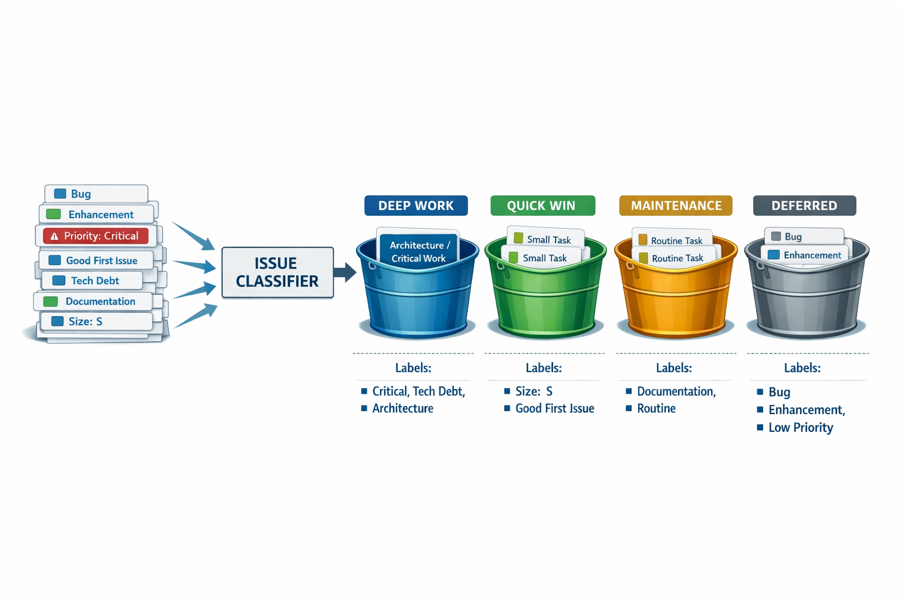

*Priority-ordered cascade: labels enter from the left, each issue lands in the first matching bucket (Deep Work → Quick Win → Maintenance → Deferred).*

### Scene 4: Measuring the Stress

The system builds a **WorldState** from 18 discrete variables, then calculates a stress score (0–100) by summing weighted components.

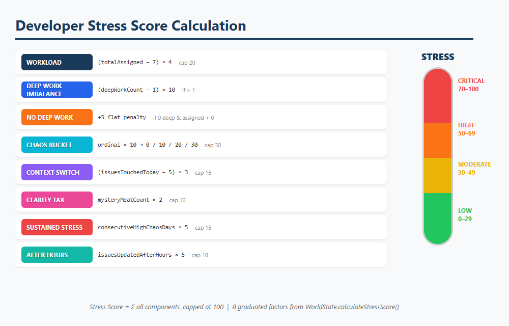

*8 graduated factors — excess workload, deep work imbalance, chaos environment, context switching, mystery meat, unclear scope, sustained stress, after-hours — each with specific formulas and caps, summed to a total capped at 100.*

### Scene 5: The Supervisor Agent Steps In

The LangChain4j **Supervisor Pattern** takes over. A planner LLM coordinates 5 specialized sub-agents to rebalance the workload.

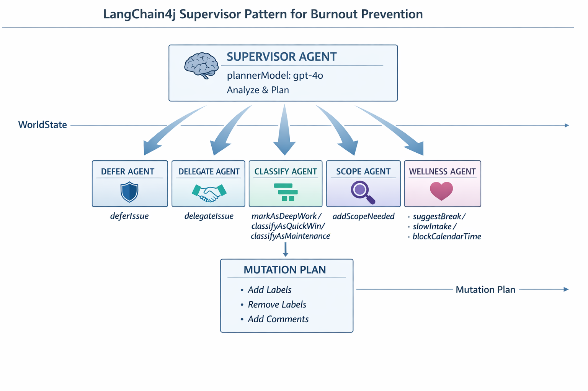

*The Supervisor pattern: planner model (gpt-5.2, SUMMARY strategy, max 10 invocations) coordinates 5 sub-agents — Defer, Delegate, Classify, Scope, Wellness — each with `@Tool` methods from `BurnoutMutationTool`. Output: a mutation plan of label additions, removals, and comments.*

### Scene 6: The Flamegraph — Seeing Stress

The flamegraph transforms abstract numbers into visceral visualization. Fire = danger, height = depth, color = urgency.

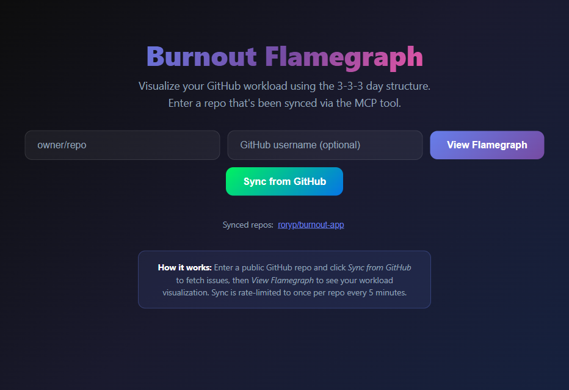

*Landing page: enter a public repo, click Sync from GitHub.*

Alex's BEFORE state — 12 issues with no labels, all in Deferred:

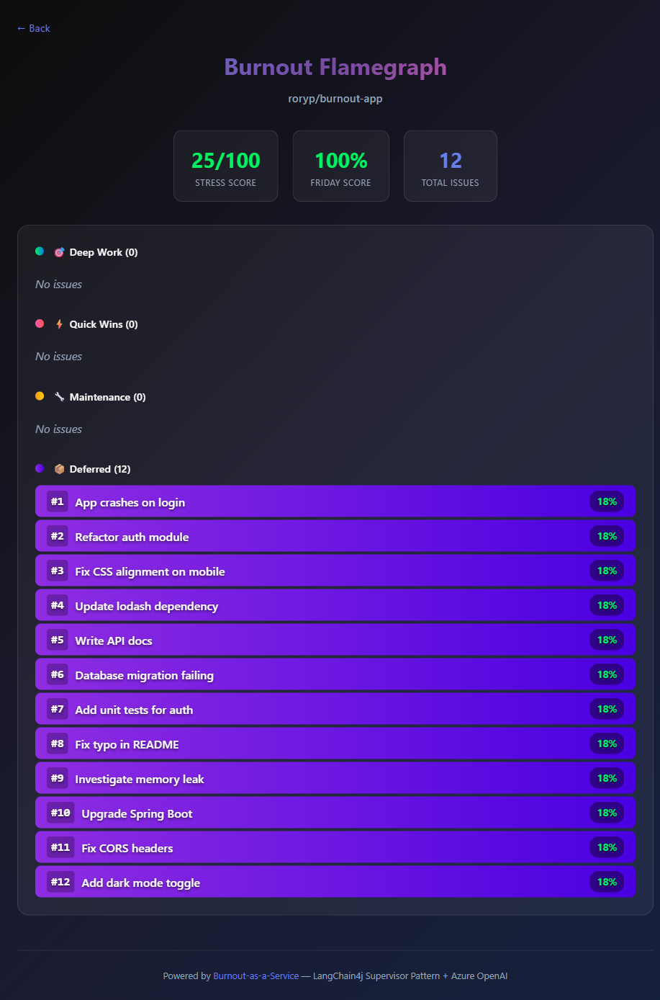

*All 12 issues in Deferred because none have classification labels. No structure at all.*

### Scene 7: Reshaping the Day

The `reshape_day` tool applies the mutation plan. Labels are added, comments posted, issues deferred. Chaos becomes structure:

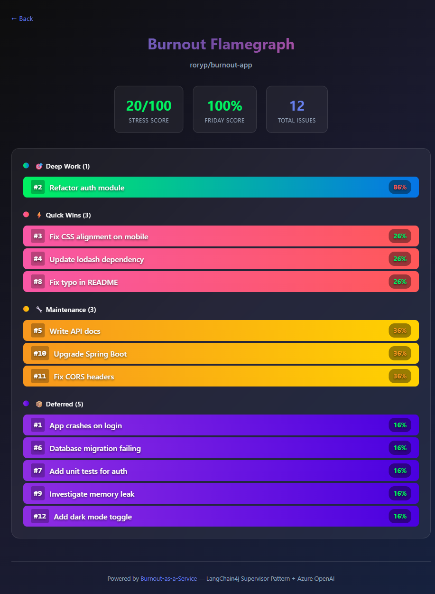

*AFTER: 1 Deep Work, 3 Quick Wins, 3 Maintenance, 5 Deferred. Same 12 issues, now with a plan.*

### Scene 8: The Balanced Developer

| Metric | Before | After |
|--------|--------|-------|
| Deep Work | 0 | 1 |
| Quick Wins | 0 | 3 |
| Maintenance | 0 | 3 |
| Deferred | 12 (all) | 5 (intentional) |
| Stress Score | 25/100 | 20/100 |
| 3-3-3 Compliant | No | Yes |

Same issues, same deadlines — but structured. That's the difference between burnout and balance.

---

## 1. Theoretical Foundations

This system is built on six published research frameworks. Each one maps directly to a specific algorithm or design decision in the codebase.

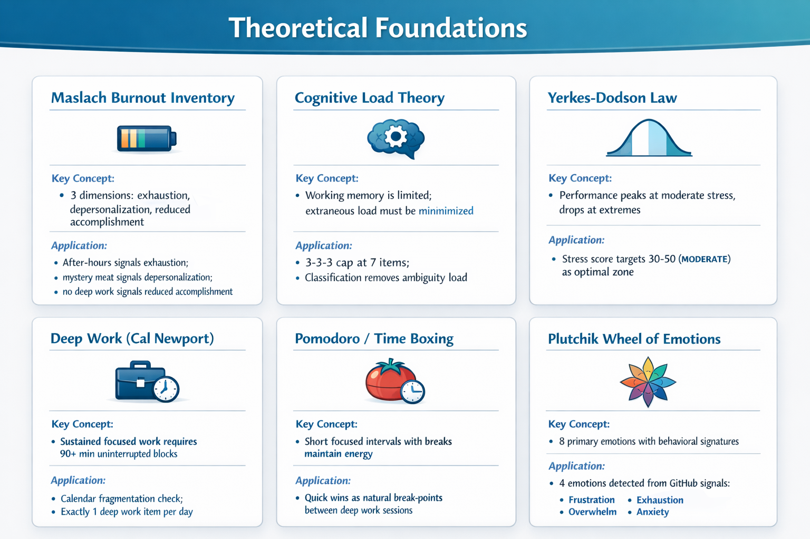

| Framework | Key Concept | How We Use It |
|-----------|-------------|---------------|
| **Maslach Burnout Inventory** [[1]](#ref-1) | 3 dimensions: exhaustion, depersonalization, reduced accomplishment | After-hours → exhaustion; mystery meat → depersonalization; no deep work → reduced accomplishment |
| **Cognitive Load Theory** [[2]](#ref-2) | Working memory is limited; extraneous load must be minimized | 3-3-3 cap at 7 items; classification removes ambiguity load |
| **Yerkes-Dodson Law** [[11]](#ref-11) | Performance peaks at moderate stress, drops at extremes | Stress score targets 30–50 (MODERATE) as optimal zone |
| **Deep Work** [[4]](#ref-4) | Sustained focused work requires 90+ min uninterrupted blocks | Calendar fragmentation check; exactly 1 deep work item per day |
| **Pomodoro / Time Boxing** | Short focused intervals with breaks maintain energy | Quick wins as natural break-points between deep work sessions |
| **Plutchik's Wheel** [[5]](#ref-5) | 8 primary emotions with behavioral signatures | 4 emotions detected from GitHub signals (frustration, exhaustion, overwhelm, anxiety) |

## 2. The 3-3-3 Day

Instead of an unbounded task list, the system caps each day at exactly **7 items** across three attention types. This comes from Miller's Law [[10]](#ref-10) (working memory holds 7 ± 2 items) and flow-state research [[3]](#ref-3) (deep work needs singular focus). Everything beyond 7 is automatically deferred — not lost, just scheduled for later.

| Slot | Count | Purpose | Psychology |
|------|-------|---------|-----------|
| Deep Work | 1 | Cognitively demanding task | Flow state requires singular focus [[3]](#ref-3) |
| Quick Wins | 3 | Small, completable tasks | Dopamine from completion; momentum builders |
| Maintenance | 3 | Routine upkeep | Low cognitive overhead; batch-processable |
| **Total** | **7** | | **Miller's Law [[10]](#ref-10): 7 ± 2 working memory limit** |

Overflow beyond 7 active items → automatically deferred. Deep work gets a protected 90-minute block.

## 3. Issue Classification

Before the system can structure a day, it needs to understand what kind of work each issue represents. [IssueClassifierService.java](../backend/src/main/java/com/demo/burnout/service/IssueClassifierService.java) examines GitHub labels and assigns every issue to one of four [Classification](../backend/src/main/java/com/demo/burnout/model/Classification.java) buckets — deterministic, priority-ordered, no LLM involved. Each issue lands in the **first** matching bucket:

| Priority | Bucket | Label Triggers |
|----------|--------|---------------|
| 1st | DEEP_WORK | `priority:critical`, `architecture`, `security`, `deep-work`, `performance`, `RFC` |
| 2nd | QUICK_WIN | `good-first-issue`, `quick-win`, `size:S`, `typo`, `chore`, `CSS` |
| 3rd | MAINTENANCE | `dependencies`, `documentation`, `maintenance`, `tech-debt`, `refactor` |
| 4th | DEFERRED | Everything else (no matching labels) |

**Hour estimation** uses label-based lookup: `security`→8h, `architecture`→6h, `deep-work`→4h, `performance`→4h, `refactor`→3h, `documentation`→2h, `chore`→1h, default→2h.

**Clear scope detection** looks for: checkboxes (`- [ ]`), "acceptance criteria", "expected"/"actual", numbered steps, or "definition of done".

## 4. Stress Score

The system's central metric — a single number (0–100) that captures how much pressure a developer is under right now, grounded in Yerkes-Dodson's [[11]](#ref-11) inverted-U model (too little stress = disengaged, too much = breakdown). [WorldState.java](../backend/src/main/java/com/demo/burnout/model/WorldState.java) holds the 18 capped variables and runs `calculateStressScore()` to produce it; [StressLevel.java](../backend/src/main/java/com/demo/burnout/model/StressLevel.java) defines the thresholds that drive protective interventions, the supervisor agent's priorities, and the flamegraph visualization. Calculated from 6 dimensions:

| Dimension | Max | Formula |
|-----------|-----|---------|
| **Workload** | 40 | `min(20, (assigned − 7) × 4)` if > 7 issues, + `(deepWork − 1) × 10` if > 1, + `5` if deepWork = 0 |
| **Chaos** | 30 | `chaosBucket.ordinal() × 10` (LOW=0, MEDIUM=10, HIGH=20, CRITICAL=30) |
| **Context Switching** [[6]](#ref-6) | 15 | `min(15, (touchedToday − 5) × 3)` if > 5 |
| **Clarity** | 15 | `min(10, mysteryMeat × 2)` + `min(5, unclearQuickWins)` |
| **Sustained** [[8]](#ref-8) | 15 | `min(15, consecutiveHighDays × 5)` |
| **After-Hours** | 10 | `min(10, afterHoursIssues × 5)` |

**Stress levels:** ≥ 70 CRITICAL, ≥ 50 HIGH, ≥ 30 MODERATE, < 30 LOW.

## 5. Chaos Metrics

While the stress score measures the individual, the chaos score (0–10) measures the *environment* — problems with the team's process. [ChaosMetricsService.java](../backend/src/main/java/com/demo/burnout/service/ChaosMetricsService.java) evaluates five binary signals, each worth 2 points, and packs the result into a [ChaosMetrics](../backend/src/main/java/com/demo/burnout/model/ChaosMetrics.java) record (score, bucket, and individual signal flags). Each reveals a different kind of dysfunction:

| Signal | Trigger | What It Reveals |
|--------|---------|-----------------|
| Mystery meat | ≥ 3 issues with blank body or no assignees | Team not investing in issue quality |
| Unresolved urgent | ≥ 3 urgent items > 24h old | Broken priority system |
| Issues touched today | ≥ 6 updated in 60 min | Reactive firefighting [[6]](#ref-6) |
| After-hours | Any update outside 8am–6pm or weekend | Boundary erosion [[7]](#ref-7) |
| Label explosion | ≥ 12 distinct labels | Taxonomy chaos → cognitive overhead [[2]](#ref-2) |

**Chaos buckets:** ≤ 2 LOW, ≤ 5 MEDIUM, ≤ 8 HIGH, > 8 CRITICAL.

## 6. Compliance Violations

Is the 3-3-3 structure actually being followed? [ComplianceService.java](../backend/src/main/java/com/demo/burnout/service/ComplianceService.java) audits the day structure — the compliance score starts at 100 and drops for each [ViolationType](../backend/src/main/java/com/demo/burnout/model/ViolationType.java), from critical issues like multiple deep-work items down to informational warnings like a growing backlog:

| Violation | Severity | Trigger | Deduction |
|-----------|----------|---------|-----------|
| `MULTIPLE_DEEP_WORK` | CRITICAL | deepWork > 1 | −25 |
| `TOTAL_OVERLOAD` | CRITICAL | activeIssues > 7 | −25 |
| `EXCESSIVE_CONTEXT_SWITCHING` | CRITICAL | touchedToday > 5 | −25 |
| `QUICK_WIN_OVERLOAD` | WARNING | quickWins > 3 | −10 |
| `MAINTENANCE_OVERLOAD` | WARNING | maintenance > 3 | −10 |
| `UNCLEAR_QUICK_WINS` | WARNING | quick-wins with no body | −10 |
| `NO_DEEP_WORK` | INFO | deepWork = 0, has issues | −5 |
| `DEFERRED_BACKLOG_GROWING` | INFO | stale deferred > 5 (14d) | −5 |

CRITICAL = actively causes burnout. WARNING = accelerates burnout trajectory. INFO = predicts future burnout.

## 7. Emotional Detection

Developers don't fill out mood surveys — but their GitHub activity tells a story. [AgentOrchestrator.java](../backend/src/main/java/com/demo/burnout/agent/AgentOrchestrator.java) detects four emotions from observable signals — context-switch frequency, after-hours commits, stale urgent issues, and workload size — mapping each to a Plutchik [[5]](#ref-5) primary family. Under stress, attention narrows [[9]](#ref-9), so the system keeps responses brief and actionable:

| Emotion | Observable Signals | Thresholds |
|---------|-------------------|-----------|
| **Frustration** (Anger family) | Context switches, blocked items | touchedToday > 5, any `blocked` label |
| **Exhaustion** (Sadness family) | After-hours activity, sustained chaos | afterHoursIssues > 0, consecutiveHighDays ≥ 2 [[1]](#ref-1) [[7]](#ref-7) |
| **Overwhelm** (Surprise family) | Too many critical items, no priorities | deepWork > 1, totalAssigned > 10 |
| **Anxiety** (Fear family) | Stale urgent items, mystery meat | unresolvedUrgent > 0, mysteryMeat > 0 |

**AI response principles:** Validate without patronizing. Concrete suggestions only. Brevity — Easterbrook [[9]](#ref-9) showed stressed people have narrowed attention, so short messages land better. No guilt or shame. One actionable item.

## 8. Protective Intervention

The system's safety net, informed by McEwen's [[8]](#ref-8) research on allostatic load — sustained stress causes cumulative physiological damage, so early intervention matters. When **any single** signal crosses a critical threshold, [ProtectiveAiService.java](../backend/src/main/java/com/demo/burnout/agent/ProtectiveAiService.java) — a LangChain4j `@AiService` with a Plutchik-informed system prompt — generates an empathetic intervention. If the LLM is unavailable, pre-written fallbacks ensure protection never silently fails.

| Trigger | Threshold |
|---------|-----------|
| Sustained stress | consecutiveHighDays ≥ 2 |
| Boundary erosion [[7]](#ref-7) | hasAfterHoursActivity() |
| Acute overload | stressScore ≥ 70 |
| Cognitive capacity | totalAssigned > 10 |

**Fallback messages** (when LLM unavailable):

| Condition | Message |
|-----------|---------|
| ≥ 3 consecutive high days | "You've had elevated stress for N days. Consider taking a short break or delegating." |
| After-hours activity | "I noticed after-hours activity — try to protect your personal time." |
| Stress ≥ 70 | "Your stress level is high. Defer one non-critical item." |
| Heavy workload | "Your workload is heavy today. Sustainable pace > heroic effort." |
| No trigger | "You're doing well! Keep up the balanced approach. 💪" |

## 9. Friday Deploy

Should you deploy on Friday? [FridayDeployAiService.java](../backend/src/main/java/com/demo/burnout/agent/FridayDeployAiService.java) answers with a readiness score (0–100), deducting points for chaos, non-compliance, unassigned urgents, after-hours signals, and poor issue quality, then generating an AI explanation of the risk. The real value: it counters **optimism bias** (“it’ll be fine”) and **completion bias** (“just ship it before the weekend”).

| Condition | Deduction |
|-----------|-----------|
| chaos > 5 | −20 |
| chaos > 8 | −20 (cumulative: −40) |
| !isCompliant | −15 |
| urgentUnassigned > 0 | −15 |
| afterHoursSignal | −10 |
| mysteryMeatCount > 3 | −10 |

**Readiness:** ≥ 80 READY 🟢, 50–79 CAUTION 🟡, < 50 NOT_READY 🔴.

## 10. Calendar Fragmentation

Deep work requires sustained focus [[4]](#ref-4) — but a day full of meetings makes that impossible. Context-switching has a 23-minute recovery cost [[6]](#ref-6), so [CalendarService.java](../backend/src/main/java/com/demo/burnout/service/CalendarService.java) scans the day for a contiguous **90-minute** block (23 min ramp-up + 60 min flow + 7 min buffer). No block? Deep work gets automatically deferred rather than setting the developer up for a frustrating, interrupted attempt.

`largestFreeBlock ≥ 90 min` → deep work feasible. Otherwise → `calendarBlocked = true` → deep work deferred.

## 11. AI Agent Architecture

Deterministic services calculate all metrics first. AI agents only explain, recommend, and act — they never make the initial measurements. This is the LangChain4j **Supervisor Pattern** in action: [AgentOrchestrator.java](../backend/src/main/java/com/demo/burnout/agent/AgentOrchestrator.java) coordinates the full pipeline from metrics through supervisor to protective response, [BurnoutAgents.java](../backend/src/main/java/com/demo/burnout/agent/supervisor/BurnoutAgents.java) declares the five sub-agent `@Agent` interfaces (Defer, Delegate, Classify, Scope, Wellness), and [AgentConfiguration.java](../backend/src/main/java/com/demo/burnout/config/AgentConfiguration.java) wires the Spring beans for both LLM models and all agent instances.

### Flow

1. **Sync** — GitHub issues → [`IssueCache`](../backend/src/main/java/com/demo/burnout/service/IssueCache.java) (ConcurrentHashMap)
2. **Calculate** — `ChaosMetricsService`, `ComplianceService`, `IssueClassifierService` run independently
3. **Build WorldState** — 18 capped variables from issue data + metrics
4. **Invoke Supervisor** — planner model coordinates 5 sub-agents autonomously
5. **Accumulate Mutations** — sub-agents invoke `@Tool` methods → [`pendingActions`](../backend/src/main/java/com/demo/burnout/agent/supervisor/BurnoutMutationTool.java) list
6. **Return Response** — explanation, [mutation plan](../backend/src/main/java/com/demo/burnout/goap/GitHubMutationPlan.java), stress scores, protective messages

### 5 Sub-Agents

| Agent | Role | Tools |
|-------|------|-------|
| **DeferAgent** | Move non-critical work to next sprint | `deferIssue()` |
| **DelegateAgent** | Redistribute across team | `delegateIssue()` |
| **ClassifyAgent** | Organize into 3-3-3 | `markAsDeepWork()`, `classifyAsQuickWin()`, `classifyAsMaintenance()` |
| **ScopeAgent** | Flag unclear issues | `addScopeNeeded()` |
| **WellnessAgent** | Recommend self-care | `suggestBreak()`, `slowIntake()`, `blockCalendarTime()` |

### 3 AI Personas

| Service | Persona | Purpose |
|---------|---------|---------|
| [**ExplainerAiService**](../backend/src/main/java/com/demo/burnout/agent/ExplainerAiService.java) | Supportive productivity coach | Explain the *why* behind the plan |
| **ProtectiveAiService** | Protective AI companion (Plutchik) | Emotional support and self-care |
| **FridayDeployAiService** | Calm release engineer | Deploy risk assessment |

### Dual Model Architecture

| Model | Role |
|-------|------|
| **plannerModel** | Supervisor — decides which sub-agents to invoke and in what order |
| **chatModel** | Sub-agents — execute tools and explain actions |

Both default to the Azure OpenAI deployment (`gpt-4o` configurable). Stress reduction estimate: each mutation reduces stress by **7 points** (heuristic).

## 12. Flamegraph Psychology

The flamegraph isn't just a chart — it's designed to exploit how the brain processes threats. [flamegraph.html](../backend/src/main/resources/static/flamegraph.html) renders the interactive visualization as a standalone page, computing per-issue heat and applying green/amber/red color mapping. Fire metaphors activate threat detection. Height conveys cognitive weight. Color maps to the universal traffic-light instinct.

| Design Element | Psychology |
|---------------|-----------|
| Fire = danger | Primal association → immediate emotional response |
| Height = depth | Taller bars feel "heavier" |
| Color = urgency | Red/amber/green maps to traffic light intuition |
| Width = proportion | Wider bars communicate relative impact |

### Per-Issue Stress

`stress = baseStress + (complexity × 3) + (globalStress × 0.3) + labelBonuses`

| Category | Base | Label Bonuses |
|----------|------|--------------|
| Deep Work | 60 | `urgent`/`critical`/`blocker`: +20 |
| Maintenance | 30 | `bug`: +10 |
| Quick Wins | 20 | |
| Deferred | 10 | |

**Global stress leak** (`× 0.3`): high-stress environments make *every* task feel harder.

**Color thresholds:** < 35% green 🟢, 35–64% amber 🟡, ≥ 65% red 🔴.

## 13. Priority & Day Plan

Once issues are classified, they still need ranking. [IssueClassifierService.java](../backend/src/main/java/com/demo/burnout/service/IssueClassifierService.java) applies a multi-level sort key to decide *which* issues fill today's 3-3-3 slots, packing the result into a [DayStructure](../backend/src/main/java/com/demo/burnout/model/DayStructure.java) record; the rest overflow to Deferred.

### Sort Key (multi-level)

1. Priority weight ascending: `priority:critical` → 0, `priority:high`/`urgent` → 1, default → 2
2. `updatedAt` descending (most recent first, nulls last)
3. Issue number ascending (stable tiebreaker)

### Day Plan Assembly

Each bucket fills its quota from the sorted list; overflow → Deferred:
- **Deep Work:** top 1 → today, remaining → deferred
- **Quick Wins:** top 3 → today, remaining → deferred
- **Maintenance:** top 3 → today, remaining → deferred

## 14. Graceful Degradation

A burnout tool that crashes when you're stressed would *increase* burnout. So every AI feature works without AI — [AgentConfiguration.java](../backend/src/main/java/com/demo/burnout/config/AgentConfiguration.java) detects whether Azure OpenAI credentials are real or dummy and sets the `llmEnabled` flag, letting all metrics run fully deterministic. For live demos, [SyntheticTimeResolver.java](../backend/src/main/java/com/demo/burnout/util/SyntheticTimeResolver.java) lets the `demo:*` labels defined in [DemoLabels.java](../backend/src/main/java/com/demo/burnout/util/DemoLabels.java) override the real clock so demos work any day of the week. The AI layers add explanation and mutation planning, but the system is complete without them.

| Level | State | Behavior |
|-------|-------|----------|
| 0 | Full LLM available | AI explanations, emotional support, supervisor active |
| 1 | LLM call fails | Catch exception → fallback response; all metrics still accurate |
| 2 | LLM not configured | `llmEnabled = false` → full deterministic operation with pre-written messages |
| 3 | Backend partially available | Health returns UP, individual endpoints degrade independently |

### Demo Label System

| Label | Effect | Bypasses |
|-------|--------|----------|
| `demo:touched-today` | Appears recently updated | Real timestamps |
| `demo:after-hours` | Triggers after-hours signal | Real clock |
| `demo:stale-14d` | Appears stale (14+ days) | Real age |
| `demo:friday` | Forces Friday context | Real day-of-week |

**Golden Rule:** If *any* `demo:*` label exists, real timestamps are never consulted.

## 15. Constants Reference

If you're reading the code and wondering "why that number?", this section explains every threshold in plain language.

### How long does deep work need?

[CalendarService.java](../backend/src/main/java/com/demo/burnout/service/CalendarService.java) won't schedule deep work unless your calendar has a free block of at least **90 minutes** — that's 23 minutes to ramp up (based on Mark's context-switching research), a full hour of flow, and a 7-minute buffer. Anything shorter and you'd just be getting started when the next meeting hits.

### What counts as "after hours"?

[ChaosMetricsService.java](../backend/src/main/java/com/demo/burnout/service/ChaosMetricsService.java) flags activity outside **8am–6pm** (or weekends) as a chaos signal. [WorldState.java](../backend/src/main/java/com/demo/burnout/model/WorldState.java) uses a slightly narrower window — **9am–6pm** — for protective interventions, so an 8:30am commit won't trigger an intervention but will still register as an early-morning chaos signal.

### When is something "stale" or "urgent"?

An issue becomes stale after **14 days** without updates — that's when [ComplianceService.java](../backend/src/main/java/com/demo/burnout/service/ComplianceService.java) triggers the deferred-backlog-growing violation. [ChaosMetricsService.java](../backend/src/main/java/com/demo/burnout/service/ChaosMetricsService.java) flags urgent items unresolved past **24 hours** and counts anything updated in the last **60 minutes** as “touched today” for context-switching detection.

### The 3-3-3 shape

One deep-work item, three quick wins, three maintenance tasks — [IssueClassifierService.java](../backend/src/main/java/com/demo/burnout/service/IssueClassifierService.java) enforces this daily quota and overflows the rest to deferred. No more than seven active issues total. These aren't arbitrary: one deep-work item protects focus, three of each lighter category gives variety without overwhelm, and the seven-item cap aligns with Miller's cognitive limit.

### How stress adds up

Each of the six stress dimensions has a cap so no single problem can blow up the score on its own — [WorldState.java](../backend/src/main/java/com/demo/burnout/model/WorldState.java)'s `calculateStressScore()` sums them into a single 0–100 number. **Workload** dominates (capped at 40) — it ramps up fast once you exceed seven assigned issues and penalizes both too many deep-work items and having none at all. **Chaos** can contribute up to 30 points, mapping directly from the environment score. **Context-switching** and **clarity** each cap at 15 — the system notices when you're juggling too many issues or when issues lack clear descriptions. **Sustained stress** adds up over consecutive bad days (capped at 15), and **after-hours activity** caps at 10.

Below 30 is LOW (you're fine). 30–49 is MODERATE (watch it). 50–69 is HIGH (take action). 70 or above is CRITICAL (the system intervenes). The flamegraph uses slightly softer thresholds for its color coding — green below 35%, amber up to 65%, red above that.

### How chaos adds up

Five binary signals, each worth two points, capping at 10 — [ChaosMetricsService.java](../backend/src/main/java/com/demo/burnout/service/ChaosMetricsService.java) asks: are there too many empty issues? Are urgent items being ignored? Is the team context-switching like crazy? Is anyone working after hours? Has the label taxonomy exploded? Two or fewer points is LOW. Five or fewer is MEDIUM. Eight or fewer is HIGH. Above that is CRITICAL.

### Friday deploy scoring

[FridayDeployAiService.java](../backend/src/main/java/com/demo/burnout/agent/FridayDeployAiService.java) starts at a perfect 100 and loses points for every red flag: high chaos costs you the most (up to 40 points if severe), non-compliance and unassigned urgent items each take a significant chunk, and after-hours signals or poorly-written issues chip away at the rest. Above 80 you're good to ship 🟢. Between 50 and 80 proceed with caution 🟡. Below 50, wait until Monday 🔴.

### Agent guardrails

[BurnoutSupervisorService.java](../backend/src/main/java/com/demo/burnout/agent/supervisor/BurnoutSupervisorService.java) caps the supervisor at **10 invocations** per reshape — enough to reorganize a messy day without running forever. Each action the agents take (defer, delegate, classify) is estimated to reduce stress by about **7 points**, a heuristic that keeps the system from over-intervening. [AgentOrchestrator.java](../backend/src/main/java/com/demo/burnout/agent/AgentOrchestrator.java) triggers protective interventions after **two consecutive high-stress days**, when stress hits **70**, or when someone has more than **10 assigned issues**.

### Flamegraph heat

[flamegraph.html](../backend/src/main/resources/static/flamegraph.html) assigns a base “heat” to each category — deep work runs hottest because it demands the most cognitive investment, followed by maintenance, quick wins, and deferred items at the coolest. Complexity multiplies on top, and high global stress bleeds into every issue (at 30%), making even small tasks look hotter when the environment is chaotic. Urgent or critical labels add a significant heat bonus; bugs add a smaller one.

---

## References

**[1]** Maslach, C., & Leiter, M. P. (2016). *Understanding the burnout experience*. World Psychiatry.

**[2]** Sweller, J. (1988). *Cognitive load during problem solving*. Cognitive Science.

**[3]** Csikszentmihalyi, M. (1990). *Flow: The psychology of optimal experience*.

**[4]** Newport, C. (2016). *Deep Work: Rules for focused success in a distracted world*.

**[5]** Plutchik, R. (2001). *The nature of emotions*. American Scientist.

**[6]** Mark, G., Gudith, D., & Klocke, U. (2008). *The cost of interrupted work: More speed and stress*. CHI Conference.

**[7]** Sonnentag, S. (2012). *Psychological detachment from work during leisure time*. Current Directions in Psychological Science.

**[8]** McEwen, B. S. (1998). *Protective and damaging effects of stress mediators*. NEJM.

**[9]** Easterbrook, J. A. (1959). *The effect of emotion on cue utilization and the organization of behavior*. Psychological Review.

**[10]** Miller, G. A. (1956). *The magical number seven, plus or minus two*. Psychological Review.

**[11]** Yerkes, R. M., & Dodson, J. D. (1908). *The relation of strength of stimulus to rapidity of habit-formation*.
